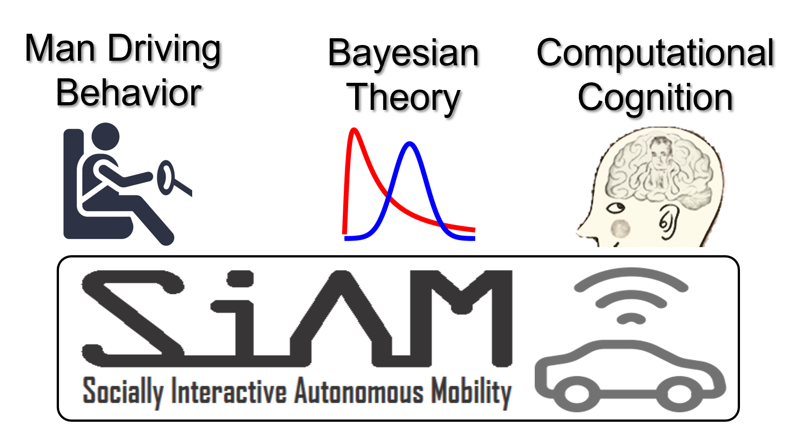

---
title:
permalink: "/"
# excerpt: 
author_profile: true
layout: archive
# redirect_from:
# - "/about/"
# - "/about.html"
---

Hi! I am a Postdoc Fellow supported by [IVADO Fellowship Awards](https://ivado.ca/en/spotlight-on-our-academic-community/?programmes=postdoctoral-research-funding) at McGill University with [Lijun Sun](https://www.mcgill.ca/civil/lijun-sun). I am also fortunate to work with [J. Karl Hedrick](https://senate.universityofcalifornia.edu/in-memoriam/files/karl-hedrick.html), [Changliu Liu](http://icontrol.ri.cmu.edu/), [Xuanlong Nguyen](http://dept.stat.lsa.umich.edu/~xuanlong/), [Ching-Yao Chan](https://path.berkeley.edu/home), and [Ding Zhao](https://safeai-lab.github.io/). I received my Ph.D. degree (Best Dissertation Award) in Mechanical Engineering from [Beijing Institute of Technology](https://me-english.bit.edu.cn/), China in 2018. Prior to joining McGill, I was a Postdoctoral Fellow (2018-2020) with [UC Berkeley, DeepDrive](https://deepdrive.berkeley.edu/) and [Carnegie Mellon University](https://www.meche.engineering.cmu.edu/). In 2015-2017, I was a visiting graduate student at [UC Berkeley](https://me.berkeley.edu/faculty/) and [University of Michigan](https://me.engin.umich.edu/). 

My research interest lies at **Cognitive Autonomy & Interactive Learning (CAIL)** --- leveraging insights of computational cognitive science with machine learning theory to enable AI-based agents more efficient, safer, and smarter when interacting with human. My research goal is to develop theoretical frameworks and practical algorithms to understand human interactions by employing **Bayesian learning** and **optimization** with the support of **computational cognitive sciences** toward **Socially Interactive Autonomous Mobility (SIAM)**, a truly safe and trustworthy system that places the human at the center of a superior driving experience, including:

* Human robot interaction, Human modeling, Cognition & perception
* Autonomous vehicles, Multi-agent interaction, Human-centric systems, Personalized mobility 
* Bayesian learning, (Inverse) Reinforcement learning, Active inference, and Optimization & control

## News 
<table style="width:100%">
  <thead>
    <tr>
      <th width="100%">&nbsp;</th>
    </tr>
  </thead>
</table>

*  New!  11/2022. Our 1st International Workshop on Socially Interactive Autonomous Mobility (SIAM) is accepted by IEEE IV'23.
*  New!  11/2022. I will give an invited talk to the Tongji University, China.
*  New!  11/2022. I will give a talk to the [Applied Research for Mobility System Group, Oak Ridge National Laboratory (ORNL)](https://www.ornl.gov/section/vehicle-and-mobility-systems-research).
*  New!  10/2022. I was invited to join the [Journal of Field Robotics](https://onlinelibrary.wiley.com/journal/15564967) as an Associate Editor.
*  New!  10/2022. Our AVVision workshop was held on the special session of [ICIP2022](https://2022.ieeeicip.org/special-sessions/).
*  New!  10/2022. I was invited to give an online talk for the School of Mechanical Engineering, Southeast University.
*  New!  09/2022. My two papers were accepted to [The Montreal AI Symposium 2022](http://montrealaisymposium.com/). 
*  New!  09/2022. Our [NSERC](https://www.nserc-crsng.gc.ca/innovate-innover/alliance-alliance/index_eng.asp) propsoal on Driving Behavior Interaction was approved by collaborating with [Changliu Liu @ CMU](http://icontrol.ri.cmu.edu/)! 
*  New!  08/2022. My new review paper on [Social Interactions for Autonomous Driving](https://arxiv.org/abs/2208.07541) is online. 
*  New!  07/2022. I was invited to give a talk on [COTA'22](http://cota-home.org/CICTP/CICTP2019.html).
*  New!  05/2022. I was recognized as the Top 50 [Rising Star Young Scholar on “AI+X”](https://mp.weixin.qq.com/s/eNcKhmhJaZ20t-0P_yusJA) by Baidu Xueshu. 
*  New!  05/2022. I was invited to give an online talk on [IEEE ICRA2022](https://www.icra2022.org/). 
*  New!  01/2022. I was invited to join [IEEE T-IV](https://ieeexplore.ieee.org/xpl/RecentIssue.jsp?punumber=7274857) as an Associate Editor.

<!-- <dl>
  <dt> <strong>Instructor</strong></dt>
  <dd> - CEE 412/CET 522: Transportation Data Management and Visualization -- Winter 2021</dd>
  <dd> &nbsp;&nbsp;&nbsp;&nbsp; - 44 undergrads and grads; rating: 4.1/5.0 </dd>
  <dd> - <a href="https://zhiyongcui.com/CEE412_CET522/">CEE 412/CET 522: Transportation Data Management and Visualization</a> -- Winter 2020 [<a href="https://zhiyongcui.com/CEE412_CET522/docs/gallery/">Gallery</a>] (CEE Department Chair's Award)</dd>
  <dd> &nbsp;&nbsp;&nbsp;&nbsp; - 50 undergrads and grads; rating: 4.1/5.0 </dd>
  <dt> <strong>Guest Lecture</strong></dt>
  <dd> - CEE 412/CET 512: Transportation Data Management -- Winter 2019</dd>
  <dd> - Engineering Discovery Days, University of Washington -- Spring 2017, 2018, 2019</dd>
  <dt> <strong>Teach Assistant</strong></dt>
  <dd> - CEE 412 / CET 512: Transportation Data Management, UW, Winter 2019</dd>
</dl> -->
<!-- <ul>
  <li><a href="https://zhiyongcui.com/CEE412_CET522/">CEE 412/CET 522: Transportation Data Management and Visualization</a> -- Winter 2020 (Instructor)[<a href="https://zhiyongcui.com/CEE412_CET522/">Gallery</a>]</li>
</ul>
 -->