<!--

  You can also find my articles on <u><a href="{{author.googlescholar}}">my Google Scholar profile</a>.</u>



  

-->

## Dissertation
- **W. Wang**. (2018) Adaptive Control of Personalized Driver Assistance Systems. *Ph.D., Mechanical Engineering, Beijing Institute of Technology* (Best Ph.D. Dissertation Awards in SAE-China)

## Journal/Conference

<table style="width:100%">
    <thead>
		<tr>
			<th width="20%">Highlight</th>
			<th width="15%">Authors</th>
			<th width="43%">Title</th>
			<th width="2%">Year</th>
			<th width="20%">Journal/Proceedings</th>
		</tr>
    </thead>
	<tbody>
  <tr id="wang2022trustworthy" class="entry">
          <td>
        

          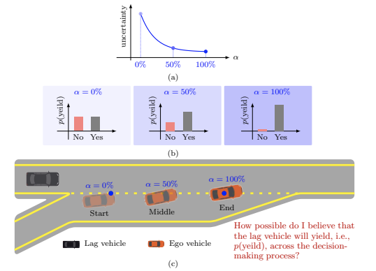
          <!-- 

          Local Prior Sensitivity
          
 -->
        

      </td>
          <td>H. Wang, <strong>W. Wang</strong>, H. Liu,  L. Sun</td>
      <td>
        On the Trustworthy Decision-Making Process of Human Drivers From the View of Perceptual Uncertainty Reduction 
                
 
                  [<a href="javascript:toggleInfo('wang2022trustworthy','abstract')">Abstract</a>]
                  <!-- [<a href="javascript:toggleInfo('wang2022trustworthy','bibtex')">BibTeX</a>]  -->
                  <!-- [<a href="https://ieeexplore.ieee.org/abstract/document/8956222">PDF</a>] -->
                  <!-- [<a href="https://arxiv.org/pdf/2007.00648">arXiv</a>] -->
                  <!-- [<a href="http://tps.uwstarlab.org/">Website</a>] -->
                  <!-- [<a href="https://zhiyongcui.com/blog/2020/07/16/graph-markov-network.html">Post</a>] -->
                  <!-- [<a href="https://github.com/zhiyongc/GraphMarkovNetwork">Code</a>] -->
                  <!-- [<a href="https://github.com/zhiyongc/Graph_Convolutional_LSTM">code</a>] -->
              

        </td>
      <td>2022</td>
          <td>IEEE Transactions on Intelligent Transportation Systems (Under review)</td>
        </tr>
        <tr id="abs_wang2022local" class="abstract noshow">
          <td colspan="5">
 <b>Abstract</b>: Humans are experts in making decisions for challenging driving tasks with uncertainties. Many efforts have been made to model the decision-making process of human drivers at the behavior level. However, limited studies explain how human drivers actively make reliable sequential decisions to complete interactive driving tasks in an uncertain environment. This paper argues that human drivers intently search for actions to reduce the uncertainty of their perception of the environment, i.e., perceptual uncertainty, to a low level that allows them to make a trustworthy decision easily. This paper provides a proof of concept framework to empirically reveal that human drivers' perceptual uncertainty decreases when executing interactive tasks with uncertainties. We first introduce an explainable-artificial intelligence approach (i.e., SHapley Additive exPlanation, SHAP) to determine the salient features and ranks on which human drivers make decisions. Then, we use entropy-based measures to quantify the drivers' perceptual changes in these ranked salient features across the decision-making process, reflecting the changes in uncertainties. The validation and verification of our proposed method are conducted in the highway on-ramp merging scenario with congested traffic using the INTERACTION dataset. Experimental results support that human drivers intentionally seek information to reduce their perceptual uncertainties in the number and rank of salient features of their perception of environments to make a trustworthy decision.  
</td>
        </tr>
        <tr id="bib_wang2022local" class="bibtex noshow">
          <td colspan="5"><b>BibTeX</b>:
                <pre>@inproceedings{wang2022local,
                      title={Local Prior Sensitivity Analysis with Gradient Descent Search for Nonparametric Bayesian Learning},
                      author={Wang, Wenshuo and Sun, Lijun},
                      booktitle={The Montreal AI Symposium 2022},
                      year={2022}
                      }
                </pre>
        </td>
    </tr>
    <tr id="wang2022local" class="entry">
          <td>
        

          
          <!-- 

          Local Prior Sensitivity
          
 -->
        

      </td>
          <td><strong>W. Wang</strong>, L. Sun</td>
      <td>
        Local Prior Sensitivity Analysis with Gradient Descent Search for Nonparametric Bayesian Learning 
                
 
                  [<a href="javascript:toggleInfo('wang2022local','abstract')">Abstract</a>]
                  [<a href="javascript:toggleInfo('wang2022local','bibtex')">BibTeX</a>] 
                  <!-- [<a href="https://ieeexplore.ieee.org/abstract/document/8956222">PDF</a>] -->
                  <!-- [<a href="https://arxiv.org/pdf/2007.00648">arXiv</a>] -->
                  <!-- [<a href="http://tps.uwstarlab.org/">Website</a>] -->
                  <!-- [<a href="https://zhiyongcui.com/blog/2020/07/16/graph-markov-network.html">Post</a>] -->
                  <!-- [<a href="https://github.com/zhiyongc/GraphMarkovNetwork">Code</a>] -->
                  <!-- [<a href="https://github.com/zhiyongc/Graph_Convolutional_LSTM">code</a>] -->
              

        </td>
      <td>2022</td>
          <td>The Montreal AI Symposium 2022</td>
        </tr>
        <tr id="abs_wang2022local" class="abstract noshow">
          <td colspan="5">
 <b>Abstract</b>: The sensitivity of Bayesian analysis is mainly influenced by data (or observations), sampling distribution, and prior parameters. Inappropriate prior specifications can lead to distorted findings for influential observations and uncertainty of the sampling model. This paper mainly focuses on providing a computationally efficient gradient search approach to analyze the prior sensitivity of nonparametric Bayesian models. For the nonparametric Bayesian model with a hierarchical scheme for the prior hyperparameters, it requires robustness, i.e., an apolitically ideal Bayesian model should be lower sensitive to its prior distribution. However, there exist some challenges due to its hierarchical schemes. One is the model complexity, the hierarchical framework has led to the development of increasingly intricate models. The other one is the uninterpretability, the parameters within deeper layers in the hierarchical model are challenging to interpret. Generally, there are two approaches to analyzing the sensitivity of Bayesian models: formal and informal. Formal approaches use considerable theoretical advances (e.g., geometric approach) but are rarely used in everyday practice due to their high-computational cost and absence of software implementation. Informal approaches repetitively rerun models with ad-hoc modified based on prior parameter values and checked the posterior densities. Usually, non-sensitivity and robustness are claimed if the posterior subjectively do not differ much. The sensitive analysis could be local or global. The global one usually applies a class of all priors compatible with the elicited prior information and computes the range of posteriors as prior varies over the class. The local one focuses on the rate of change in posterior density to the changes in the prior, which is usually easier to compute than global. 
</td>
        </tr>
        <tr id="bib_wang2022local" class="bibtex noshow">
          <td colspan="5"><b>BibTeX</b>:
                <pre>@inproceedings{wang2022local,
                      title={Local Prior Sensitivity Analysis with Gradient Descent Search for Nonparametric Bayesian Learning},
                      author={Wang, Wenshuo and Sun, Lijun},
                      booktitle={The Montreal AI Symposium 2022},
                      year={2022}
                      }
                </pre>
        </td>
    </tr>
		<tr id="wang2022action" class="entry">
      		<td>
				<!--  -->
				

				  
				  <!-- 

				  Active Inference and Optimization
				  
 -->
				

			</td>
       		<td><strong>W. Wang</strong>, C. Zhang, L. Sun</td>
			<td>
				An Action-Induced Model through Active Inference with Variational Bounds and Optimization
         
				<!-- (ASA TSIG Student Paper Award)  -->
              	
 
              		[<a href="javascript:toggleInfo('wang2022action','abstract')">Abstract</a>]
              		[<a href="javascript:toggleInfo('wang2022action','bibtex')">BibTeX</a>] 
              		<!-- [<a href="https://ieeexplore.ieee.org/abstract/document/8956222">PDF</a>] -->
              		<!-- [<a href="https://arxiv.org/abs/1912.05457">arXiv</a>]
                  [<a href="https://zhiyongcui.com/blog/2020/07/16/graph-markov-network.html">Post</a>]
                  [<a href="https://github.com/zhiyongc/GraphMarkovNetwork">Code</a>] -->
              		<!-- [<a href="https://github.com/zhiyongc/Graph_Convolutional_LSTM">code</a>] -->
            	

    		</td>
 			<td>2022</td>
        	<td>The Montreal AI Symposium 2022</td>
        </tr>
        <tr id="abs_wang2022action" class="abstract noshow">
        	<td colspan="5">
 <b>Abstract</b>: Modeling the action-reaction mechanism of human agents in interactive scenarios such as human drivers in real traffic is challenging. Rational human agents usually negotiate with others by actively perceiving information about the world via proactively taking specific actions that influence the world. For instance, in real traffic, human drivers make tentative attempts before decisively switching lanes as a way to signify their intention of lane switch and tease out the intentions of other vehicles in the adjoining lanes. However, it is still unclear (i) why a tentative behavior is efficient and matters in human interactions and (ii) how it could be modeled in an interpretable learning framework. This paper provides a new framework for modeling the process of generating actions by humans in interactive scenarios using active inference with the free energy theory. The hypothesis is that humans execute tentative behaviors to reduce the sensory uncertainties arising from people's quantity of possible outcomes, enabling them to make efficient decisions. We show a proof of concept that the process by that humans take tentative actions in interaction can be viewed as an optimization problem over variational bounds.  
</td>
      	</tr>
        <tr id="bib_wang2022action" class="bibtex noshow">
          <td colspan="5"><b>BibTeX</b>:
                <pre>@inproceedings{wang2022action,
                      title={An Action-Induced Model through Active Inference with Variational Bounds and Optimization},
                      author={Wang, Wenshuo and Zhang, Chengyuan and Sun, Lijun},
                      booktitle={The Montreal AI Symposium 2022},
                      year={2022}
                    }
                  </pre>
      </td>
    </tr>
    <tr id="wang2022social" class="entry">
          <td>
        <!--  -->
        

          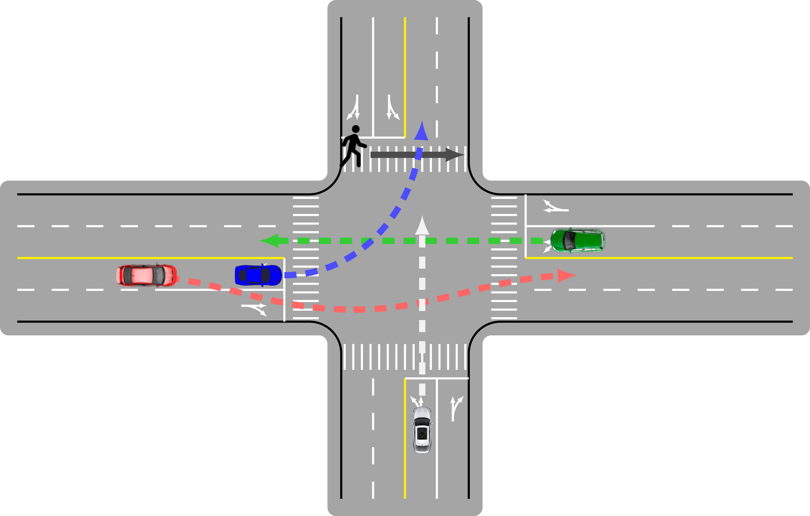
          <!-- 

          Social Interaction
          
 -->
        

      </td>
          <td><strong>W. Wang</strong>, L. Wang, C. Zhang, C. Liu, L. Sun</td>
      <td>
        Social Interactions for Autonomous Driving: A Review and Perspectives 
                
 
                  [<a href="javascript:toggleInfo('wang2022social','abstract')">Abstract</a>]
                  [<a href="javascript:toggleInfo('wang2022social','bibtex')">BibTeX</a>] 
                  <!-- [<a href="https://ieeexplore.ieee.org/abstract/document/8956222">PDF</a>] -->
                  [<a href="https://arxiv.org/abs/2208.07541">arXiv</a>]
                  <!-- [<a href="https://github.com/zhiyongc/Graph_Convolutional_LSTM">code</a>] -->
              

        </td>
      <td>2022</td>
          <td>Foundations and Trends in Robotics (Under review)</td>
        </tr>
        <tr id="abs_wang2022social" class="abstract noshow">
          <td colspan="5">
 <b>Abstract</b>: No human drives a car in a vacuum; she/he must negotiate with other road users to achieve their goals in social traffic scenes. A rational human driver can interact with other road users in a socially-compatible way through implicit communications to complete their driving tasks smoothly in interaction-intensive, safety-critical environments. This paper aims to review the existing approaches and theories to help understand and rethink the interactions among human drivers toward social autonomous driving. We take this survey to seek the answers to a series of fundamental questions: 1) What is social interaction in road traffic scenes? 2) How to measure and evaluate social interaction? 3) How to model and reveal the process of social interaction? 4) How do human drivers reach an implicit agreement and negotiate smoothly in social interaction? This paper reviews various approaches to modeling and learning the social interactions between human drivers, ranging from optimization theory, deep learning, and graphical models to social force theory and behavioral & cognitive science. We also highlight some new directions, critical challenges, and opening questions for future research.
</td>
        </tr>
        <tr id="bib_wang2022social" class="bibtex noshow">
          <td colspan="5"><b>BibTeX</b>:
                <pre>@article{wang2022social,
                      title={Social Interactions for Autonomous Driving: A Review and Perspective},
                      author={Wang, Wenshuo and Wang, Letian and Zhang, Chengyuan and Liu, Changliu and Sun, Lijun},
                      journal={arXiv preprint arXiv:2208.07541},
                      year={2022}
                      }
                </pre>
      </td>
    </tr>
    <tr id="wang2022cv" class="entry">
      <td>
        <!--  -->
        

          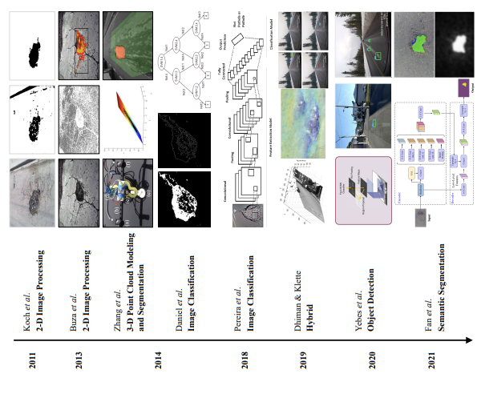
          <!-- 

          Gated Graph Wavelet RNN
          
 -->
        

      </td>
      <td>N. Ma, J. Fan, <strong>W. Wang</strong>, et al.</td>
      <td>
        Computer vision for road imaging and pothole detection: A state-of-the-art review of systems and algorithms 
        <!-- 
          (Winner of Best Student Paper)
         -->
                
 
                  [<a href="javascript:toggleInfo('wang2022cv','abstract')">Abstract</a>]
                  [<a href="javascript:toggleInfo('wang2022cv','bibtex')">BibTeX</a>] 
                  [<a href="https://arxiv.org/abs/2204.13590">PDF</a>]
                  <!-- [<a href="https://arxiv.org/abs/1802.07007">arXiv</a>] -->
                  <!-- [<a href="https://github.com/zhiyongc/Graph_Convolutional_LSTM">code</a> -->
              

      </td>
      <td>2022</td>
      <td>Transportation Safety and Environment</td>
      </tr>
        <tr id="abs_wang2022cv" class="abstract noshow">
          <td colspan="5">
 <b>Abstract</b>: Computer vision algorithms have been prevalently utilized for 3-D road imaging and pothole detection for over two decades. Nonetheless, there is a lack of systematic survey articles on state-of-the-art (SoTA) computer vision techniques, especially deep learning models, developed to tackle these problems. This article first introduces the sensing systems employed for 2-D and 3-D road data acquisition, including camera(s), laser scanners, and Microsoft Kinect. Afterward, it thoroughly and comprehensively reviews the SoTA computer vision algorithms, including (1) classical 2-D image processing, (2) 3-D point cloud modeling and segmentation, and (3) machine/deep learning, developed for road pothole detection. This article also discusses the existing challenges and future development trends of computer vision-based road pothole detection approaches: classical 2-D image processing-based and 3-D point cloud modeling and segmentation-based approaches have already become history; and Convolutional neural networks (CNNs) have demonstrated compelling road pothole detection results and are promising to break the bottleneck with the future advances in self/un-supervised learning for multi-modal semantic segmentation. We believe that this survey can serve as practical guidance for developing the next-generation road condition assessment systems.
</td>
        </tr>
        <tr id="bib_wang2022cv" class="bibtex noshow">
          <td colspan="5"><b>BibTeX</b>:
                <pre>@article{ma2022computer,
                      title={Computer vision for road imaging and pothole detection: A state-of-the-art review of systems and algorithms},
                      author={Ma, Nachuan and Fan, Jiahe and Wang, Wenshuo and Wu, Jin and Jiang, Yu and Xie, Lihua and Fan, Rui},
                      journal={arXiv preprint arXiv:2204.13590},
                      year={2022}
                    }
                </pre>
            </td>
        </tr>
  	<!-- <tr id="bib_cui2019graph" class="bibtex noshow">
        	<td colspan="5"><b>BibTeX</b>:
              	<pre>@article{cui2019graph,
  title={Graph Markov Network for Traffic Forecasting with Missing Data},
  author={Cui, Zhiyong and Lin, Longfei and Pu, Ziyuan and Wang, Yinhai},
  journal={arXiv preprint arXiv:1912.05457},
  year={2019}
}</pre>
			</td>
      	</tr> -->
      	<tr id="wang2022instance" class="entry">
      		<td>
				

				  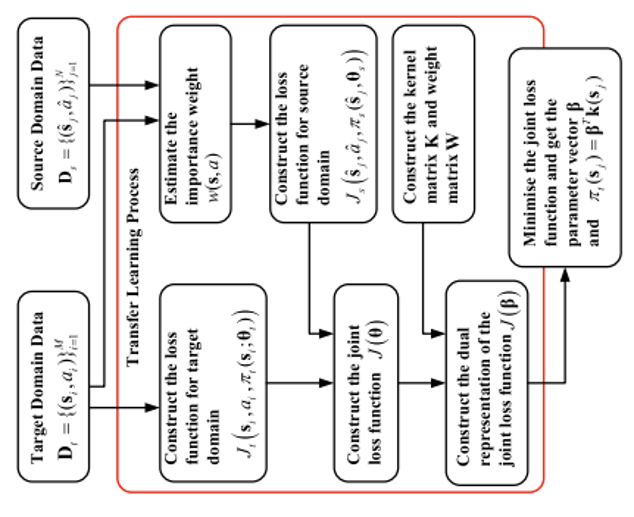
				

			</td>
       		<td>C. Lu, C. Lv, <strong>W. Wang</strong>, et al. </td>
			<td>
				Instance-Level Knowledge Transfer for Data-Driven Driver Model Adaptation With Homogeneous Domains 
              	
 
              		[<a href="javascript:toggleInfo('wang2022instance','abstract')">Abstract</a>]
              		[<a href="javascript:toggleInfo('cui2019graph','bibtex')">BibTeX</a>] 
              		[<a href="https://ieeexplore.ieee.org/abstract/document/9745808">PDF</a>]
              		<!-- [<a href="https://arxiv.org/abs/1912.05457">arXiv</a>] -->
              		<!-- [<a href="https://github.com/zhiyongc/Graph_Convolutional_LSTM">code</a>] -->
              		<!-- [<a href="https://zhiyongcui.com/TRAFFIX_Web/">Website</a>] -->
              		<!-- [<a href="http://c2smart.engineering.nyu.edu/2019/04/19/an-artificial-intelligence-platform-for-network-wide-congestion-detection-and-prediction-using-multi-source-data-2/">Project</a>] -->
              		<!-- [<a href="http://c2smart.engineering.nyu.edu/wp-content/uploads/2019/07/Transportation_AI%20Platform_FinalReport_C2SMART_Wang.pdf">Report</a>] -->
            	

    		</td>
 			<td>2022</td>
        	<td>IEEE Transactions on Intelligent Transportation Systems </td>
        </tr>
        <tr id="abs_wang2022instance" class="abstract noshow">
        	<td colspan="5">
 <b>Abstract</b>: Driver model adaptation (DMA) plays an essential role for driving behaviour modelling when there is a lack of sufficient data for training the new model. A new data-driven DMA method is proposed in this paper to realise the instance-level knowledge transfer between individual drivers. Using the importance-weighted transfer learning (IWTL), the data collected from one driver (source driver) can be directly used to train the model of another driver (target driver). Under the framework of IWTL, the relationship between two different drivers can be modelled by the importance weight (IW). Two estimation methods Kullback-Leibler (KL) Divergence and least-squares (LS), are used to estimate IW for each data instance by modelling the importance-weight function as a radial basis function (RBF). Experiments based on the driving simulator and real vehicle are carried out to test the performance of TL for steering behaviour adaptation during the overtaking manoeuvre. The experimental results show that the TL method can transfer the knowledge observed from one driver to another when training the new driver model without sufficient data by keeping the modelling error at a low level.
</td>
      	</tr>
      	<tr id="bib_wang2022instance" class="bibtex noshow">
        	<td colspan="5"><b>BibTeX</b>:
              	<pre>@article{lu2022instance,
                    title={Instance-Level Knowledge Transfer for Data-Driven Driver Model Adaptation With Homogeneous Domains},
                    author={Lu, Chao and Lv, Chen and Gong, Jianwei and Wang, Wenshuo and Cao, Dongpu and Wang, Fei-Yue},
                    journal={IEEE Transactions on Intelligent Transportation Systems},
                    year={2022},
                    publisher={IEEE}
                  }
                </pre>
          </td>
      	</tr>
		<tr id="wang2021social" class="entry">
      		<td>
				<!--  -->
				

				  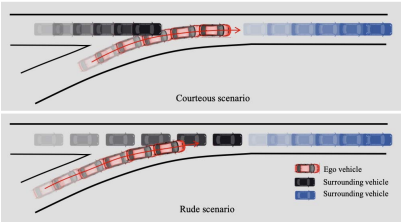
				

			</td>
       		<td>H. Wang, <strong>W. Wang*</strong>, S. Yuan, X. Li, L. Sun</td>
			<td>
				On Social Interactions of Merging Behaviors at Highway On-Ramps in Congested Traffic 
				<!-- 
					(Winner of Best Student Paper)
				 -->
              	
 
              		[<a href="javascript:toggleInfo('wang2021social','abstract')">Abstract</a>]
              		[<a href="javascript:toggleInfo('wang2021social','bibtex')">BibTeX</a>] 
              		[<a href="https://ieeexplore.ieee.org/abstract/document/9511791">PDF</a>]
              		<!-- [<a href="https://arxiv.org/abs/1811.04745">arXiv</a>] -->
              		<!-- [<a href="https://github.com/zhiyongc/Graph_Convolutional_LSTM">code</a> -->
            	

    		</td>
 			<td>2021</td>
        	<td>IEEE Transportation on Intelligent Transportation Systems</td>
        </tr>
        <tr id="abs_ma2020forecasting" class="abstract noshow">
        	<td colspan="5">
 <b>Abstract</b>: Merging at highway on-ramps while interacting with other human-driven vehicles is challenging for autonomous vehicles (AVs). An efficient route to this challenge requires exploring and exploiting knowledge of the interaction process from demonstrations by humans. However, it is unclear what information (or environmental states) is utilized by the human driver to guide their behavior throughout the whole merging process. This paper provides quantitative analysis and evaluation of the merging behavior at highway on-ramps with congested traffic in a volume of time and space. Two types of social interaction scenarios are considered based on the social preferences of surrounding vehicles: courteous and rude. The significant levels of environmental states for characterizing the interactive merging process are empirically analyzed based on the real-world INTERACTION dataset. Experimental results reveal two fundamental mechanisms in the merging process: 1) Human drivers select different states to make sequential decisions at different moments of task execution; and 2) the social preference of surrounding vehicles can impact variable selection for making decisions. It implies that efficient decision-making design should filter out irrelevant information while considering social preference to achieve comparable human-level performance. These essential findings shed light on developing new decision-making approaches for AVs.
</td>
      	</tr>
      	<tr id="bib_wang2021social" class="bibtex noshow">
        	<td colspan="5"><b>BibTeX</b>:
              	<pre>@article{wang2021social,
                    title={On social interactions of merging behaviors at highway on-ramps in congested traffic},
                    author={Wang, Huanjie and Wang, Wenshuo and Yuan, Shihua and Li, Xueyuan and Sun, Lijun},
                    journal={IEEE Transactions on Intelligent Transportation Systems},
                    volume = {23},
                    number = {8},
                    pages = {11237--11248},
                    year={2021},
                    publisher={IEEE}
                  }
                </pre>
			    </td>
      	</tr>
      	<tr id="wang2021leverage" class="entry">
      		<td>
				<!--  -->
				

				  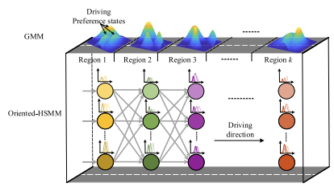
				

			</td>
       		<td>S. Yang, <strong>W. Wang*</strong>, J. Xi</td>
			<td>
				Leveraging Human Driving Preferences to Predict Vehicle Speed 
              	
 
              		[<a href="javascript:toggleInfo('wang2021leverage','abstract')">Abstract</a>]
              		[<a href="javascript:toggleInfo('wang2021leverage','bibtex')">BibTeX</a>] 
              		[<a href="https://ieeexplore.ieee.org/abstract/document/9511318">PDF</a>] 
              		<!-- [<a href="https://arxiv.org/abs/1802.07007">arXiv</a>] -->
              		<!-- [<a href="https://github.com/zhiyongc/Graph_Convolutional_LSTM">Code</a>] -->
            	

    		</td>
 			<td>2021</td>
        	<td>IEEE Transportation on Intelligent Transportation Systems</td>
        </tr>
        <tr id="abs_wang2021leverage" class="abstract noshow">
        	<td colspan="5">
 <b>Abstract</b>: Accurate speed prediction is practically critical to eco-safe driving for intelligent vehicles. Existing research only makes vehicles adapt to the dynamic driving environment while rarely considering the influence of human driving preferences. This paper proposes a learning-based model to leverage human driving preferences into speed prediction. We first designed an Oriented Hidden Semi-Markov Model (Oriented-HSMM) to learn and predict the driver’s driving preference sequences while considering traffic flow influence. Then, we developed an optimal speed prediction algorithm to retrieve the smooth speed trajectories with maximal likelihood based on the estimated driving preferences. Finally, we evaluated the proposed model using the Next Generation Simulation (NGSIM) data compared to its counterparts that do not consider driving preferences. Experimental results demonstrate that our proposed Oriented-HSMM method reaches the best results and achieves a satisfying performance with a low mean absolute error (4.16 km/h) and root mean square error (5.08 km/h) at a 200 m prediction horizon.
</td>
      	</tr>
      	<tr id="bib_wang2021leverage" class="bibtex noshow">
        	<td colspan="5"><b>BibTeX</b>:
              	<pre>@article{yang2021leveraging,
                      title={Leveraging human driving preferences to predict vehicle speed},
                      author={Yang, Sen and Wang, Wenshuo and Xi, Junqiang},
                      journal={IEEE Transactions on Intelligent Transportation Systems},
                      volume = {23},
                      number = {8},
                      pages = {11137--11147},
                      year={2021},
                      publisher={IEEE}
                    }
                </pre>
			</td>
      	</tr>
      	<tr id="wang2021spatio" class="entry">
      <td>
				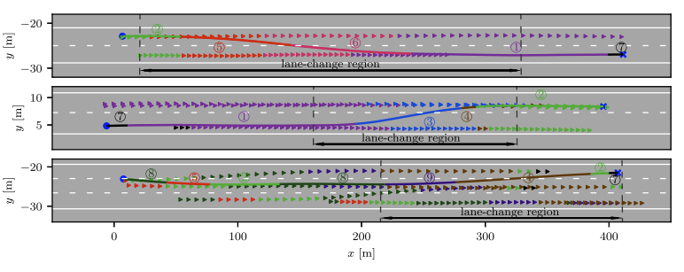
			</td>
       		<td>C. Zhang, J. Zhu, <strong>W. Wang*</strong>, J. Xi </td>
			<td>
				Spatiotemporal Learning of Multivehicle Interaction Patterns in Lane-Change Scenarios 
              	
 
              		[<a href="javascript:toggleInfo('wang2021spatio','abstract')">Abstract</a>]
              		[<a href="javascript:toggleInfo('wang2021spatio','bibtex')">BibTeX</a>] 
              		[<a href="https://ieeexplore.ieee.org/abstract/document/9357407">PDF</a>]
              		<!-- [<a href="https://arxiv.org/abs/1811.04745">arXiv</a>] -->
              		<!-- [<a href="https://github.com/zhiyongc/Graph_Convolutional_LSTM">code</a> -->
            	

    		</td>
 			<td>2021</td>
        	<td> IEEE Transactions on Intelligent Transportation Systems </td>
        </tr>
        <tr id="abs_wang2021spatio" class="abstract noshow">
        	<td colspan="5">
 <b>Abstract</b>: Interpretation of common-yet-challenging inter- action scenarios can benefit well-founded decisions for autonomous vehicles. Previous research achieved this using their prior knowledge of specific scenarios with predefined models, limiting their adaptive capabilities. This paper describes a Bayesian nonparametric approach that leverages continuous (i.e., Gaussian processes) and discrete (i.e., Dirichlet processes) stochastic processes to reveal underlying interaction patterns of the ego vehicle with other nearby vehicles. Our model relaxes dependency on the number of surrounding vehicles by developing an acceleration-sensitive velocity field based on Gaussian processes. The experiment results demonstrate that the velocity field can represent the spatial interactions between the ego vehicle and its surroundings. A discrete Bayesian nonparametric model, integrating Dirichlet processes and hidden Markov models, is developed to learn the interaction patterns over the temporal space by segmenting and clustering the sequential interaction data into interpretable granular patterns automatically. We then evaluate our approach in the highway discretionary lane-change scenarios using the highD dataset collected from real-world settings. Results demonstrate that our proposed Bayesian nonparametric approach provides an insight into the complicated discretionary lane-change interactions of the ego vehicle with multiple surrounding traffic participants based on the interpretable interaction patterns and their transition properties in temporal relationships. Our proposed approach sheds light on efficiently analyzing other kinds of multi-agent interactions, such as vehicle-pedestrian interactions.
</td>
      	</tr>
      	<tr id="bib_wang2021spatio" class="bibtex noshow">
        	<td colspan="5"><b>BibTeX</b>:
              	<pre>@article{zhang2021spatiotemporal,
                    title={Spatiotemporal learning of multivehicle interaction patterns in lane-change scenarios},
                    author={Zhang, Chengyuan and Zhu, Jiacheng and Wang, Wenshuo and Xi, Junqiang},
                    journal={IEEE Transactions on Intelligent Transportation Systems},
                    volume = {23},
                    number = {7},
                    pages = {6446--6459},
                    year={2021},
                    publisher={IEEE}
                    }
                </pre>
			</td>
      	</tr>
      	<tr id="wang2021uncover" class="entry">
      		<td>
				<!--  -->
				

				  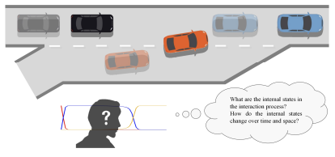
				

			</td>
       		<td>H. Wang, <strong>W. Wang*</strong>, S. Yuan, X. Li </td>
			<td>
				Uncovering Interpretable Internal States of Merging Tasks at Highway On-Ramps for Autonomous Driving Decision-Making 
              	
 
              		[<a href="javascript:toggleInfo('wang2021uncover','abstract')">Abstract</a>]
              		[<a href="javascript:toggleInfo('wang2021uncover','bibtex')">BibTeX</a>] 
              		[<a href="https://ieeexplore.ieee.org/abstract/document/9512609">PDF</a>]
              		<!-- [<a href="https://arxiv.org/abs/1508.06033">arXiv</a>] -->
              		<!-- [<a href="https://github.com/zhiyongc/Graph_Convolutional_LSTM">code</a> -->
            	

    		</td>
 			<td>2021</td>
        	<td>IEEE Transactions on Automation Science and Engineering</td>
        </tr>
        <tr id="abs_wang2021uncover" class="abstract noshow">
        	<td colspan="5">
 <b>Abstract</b>: Humans make daily routine decisions based on their internal states in intricate interaction scenarios. This article presents a probabilistically reconstructive learning approach to identify the internal states of multivehicle sequential interactions when merging at highway on-ramps. We treated the merging task's sequential decision as a dynamic, stochastic process and then integrated the internal states into a hidden Markov model (HMM)-Gaussian mixture regression (GMR) model, a probabilistic combination of an extended GMR and HMM. We also developed a variant of the expectation-maximization (EM) algorithm to estimate the model parameters and verified it based on a real-world dataset. Experiment results reveal that three interpretable internal states can semantically describe the interactive merge procedure at highway on-ramps. This finding provides a basis for developing an efficient model-based decision-making algorithm for autonomous vehicles (AVs) in a partially observable environment.
</td>
      	</tr>
      	<tr id="bib_wang2021uncover" class="bibtex noshow">
        	<td colspan="5"><b>BibTeX</b>:
              	<pre>@article{wang2021uncovering,
                      title={Uncovering interpretable internal states of merging tasks at highway on-ramps for autonomous driving decision-making},
                      author={Wang, Huanjie and Wang, Wenshuo and Yuan, Shihua and Li, Xueyuan},
                      journal={IEEE Transactions on Automation Science and Engineering},
                      year={2021},
                      publisher={IEEE}
                    }
                </pre>
			      </td>
      	</tr>
      	<tr id="wang2021learning" class="entry">
      		<td>
				<!--  -->
				

				  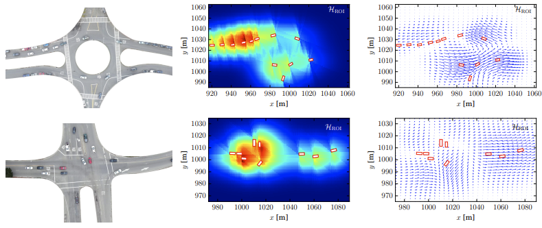
				

			</td>
       		<td><strong>W. Wang</strong>, C. Zhang, P. Wang, C.-Y. Chan </td>
			<td>
				Learning Representations for Multi-Vehicle Spatiotemporal Interactions with Semi-Stochastic Potential Fields 
              	
 
              		[<a href="javascript:toggleInfo('wang2021learning','abstract')">Abstract</a>]
              		[<a href="javascript:toggleInfo('wang2021learning','bibtex')">BibTeX</a>] 
              		[<a href="https://ieeexplore.ieee.org/abstract/document/9304849">PDF</a>]
              		<!-- [<a href="https://arxiv.org/abs/1801.03818">arXiv</a>] -->
              		<!-- [<a href="https://github.com/zhiyongc/Graph_Convolutional_LSTM">code</a> -->
            	

    		</td>
 			<td>2020</td>
        	<td>2020 IEEE Intelligent Vehicles Symposium (IV'20)</td>
        </tr>
        <tr id="abs_wang2021learning" class="abstract noshow">
        	<td colspan="5">
 <b>Abstract</b>: Reliable representation of multi-vehicle interactions in urban traffic is pivotal but challenging for autonomous vehicles due to the volatility of the traffic environment, such as roundabouts and intersections. This paper describes a semi-stochastic potential field approach to represent multi-vehicle interactions by integrating a deterministic field approach with a stochastic one. First, we conduct a comprehensive evaluation of potential fields for representing multi-agent intersections from the deterministic and stochastic perspectives. For the former, the estimates at each location in the region of interest (ROI) are deterministic, which is usually built using a family of parameterized exponential functions directly. For the latter, the estimates are stochastic and specified by a random variable, which is usually built based on stochastic processes such as the Gaussian process. Our proposed semi-stochastic potential field, combining the best of both, is validated based on the INTERACTION dataset collected in complicated real-world urban settings, including intersections and roundabout. Results demonstrate that our approach can capture more valuable information than either the deterministic or stochastic ones alone. This work sheds light on the development of algorithms in decision-making, path/motion planning, and navigation for autonomous vehicles in the cluttered urban settings.
</td>
      	</tr>
      	<tr id="bib_wang2021learning" class="bibtex noshow">
        	<td colspan="5"><b>BibTeX</b>:
              	<pre>@inproceedings{wang2020learning,
                    title={Learning Representations for Multi-Vehicle Spatiotemporal Interactions with Semi-Stochastic Potential Fields},
                    author={Wang, Wenshuo and Zhang, Chengyuan and Wang, Pin and Chan, Ching-Yao},
                    booktitle={2020 IEEE Intelligent Vehicles Symposium (IV)},
                    pages={1935--1940},
                    organization={IEEE}
                  }
                </pre>
			    </td>
      	</tr>
      	<tr id="wang2020clustering" class="entry">
      		<td>
				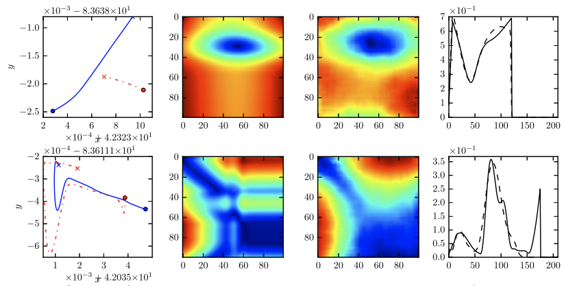
    			</td>
       		<td><strong>W. Wang</strong>, A. Ramesh, et al. </td>
			<td>
				Clustering Driving Encounter Scenarios Using Connected Vehicle Trajectories 
              	
 
              		[<a href="javascript:toggleInfo('wang2020clustering','abstract')">Abstract</a>]
              		[<a href="javascript:toggleInfo('wang2020clustering','bibtex')">BibTeX</a>] 
              		[<a href="https://ieeexplore.ieee.org/abstract/document/8995532">PDF</a>]
              		<!-- [<a href="https://arxiv.org/abs/1801.02143">arXiv</a>] -->
              		<!-- [<a href="https://github.com/zhiyongc/Stacked_Bidirectional_Unidirectional_LSTM">Code</a>] -->
            	

    		</td>
 			<td>2020</td>
        	<td>IEEE Transactions on Intelligent Vehicles</td>
        </tr>
        <tr id="abs_wang2020clustering" class="abstract noshow">
        	<td colspan="5">
 <b>Abstract</b>: Classification and analysis of driving behaviors offer in-depth knowledge to make an efficient decision for autonomous vehicles. This paper aims to cluster a wide range of driving encounter scenarios based only on multi-vehicle GPS trajectories. Towards this end, we propose a generic unsupervised learning framework comprising of two layers: feature representation layer and clustering layer. In the feature representation layer, we combine the deep autoencoders with a distance-based measure to map the sequential observations of driving encounters into a computationally tractable space, which quantifies the spatiotemporal interaction characteristics of two vehicles. The clustering algorithm is then applied to the extracted representations to cluster homogeneous driving encounters into groups. Our proposed generic framework is then evaluated using 2,568 naturalistic driving encounters. Experimental results show that our proposed generic framework incorporated with unsupervised learning can cluster multi-trajectory data into distinct groups. These clustering results could benefit the decision-making and design of autonomous vehicles
</td>
      	</tr>
      	<tr id="bib_wang2020clustering" class="bibtex noshow">
        	<td colspan="5"><b>BibTeX</b>:
              	<pre>@article{wang2020clustering,
                      title={Clustering of driving encounter scenarios using connected vehicle trajectories},
                      author={Wang, Wenshuo and Ramesh, Aditya and Zhu, Jiacheng and Li, Jie and Zhao, Ding},
                      journal={IEEE Transactions on intelligent vehicles},
                      volume={5},
                      number={3},
                      pages={485--496},
                      year={2020},
                      publisher={IEEE}
                    }
                </pre>
			</td>
      	</tr>
      	<tr id="wang2020understanding" class="entry">
      		<td>
				

				  
				

			</td>
       		<td><strong>W. Wang</strong>, W. Zhang, J. Zhu, D. Zhao </td>
			<td>
				Understanding v2v driving scenarios through traffic primitives 		   
              	
 
              		[<a href="javascript:toggleInfo('wang2020understanding','abstract')">Abstract</a>]
              		[<a href="javascript:toggleInfo('wang2020understanding','bibtex')">BibTeX</a>] 
              		[<a href="https://ieeexplore.ieee.org/abstract/document/9184261">PDF</a>]
              		<!-- [<a href="http://www.uwdrive.net/">Website</a>] -->
              		<!-- [<a href="https://www.youtube.com/watch?v=uzOl3cNoLvc">Video</a>] -->
              		<!-- [<a href="https://github.com/zhiyongc/Graph_Convolutional_LSTM">code</a> -->
            	

    		</td>
 			<td>2020</td>
        	<td>IEEE Transactions on Intelligent Transportation Systems</td>
        </tr>
        <tr id="abs_wang2020understanding" class="abstract noshow">
        	<td colspan="5">
 <b>Abstract</b>: Understanding driver interaction behavioral semantics has potential benefits to autonomous car’s decision-making design. This article presents a framework of analyzing various encountering behaviors through decomposing driving encounter sequential data into small building blocks, called traffic primitives, using a Bayesian nonparametric learning (BNPL) approach. This framework offers a flexible way to gain semantic insights into complex driving encounters without any prerequisite knowledge of interaction behavior categories. Its effectiveness is then validated using 976 naturalistic driving encounters from which more than 4000 traffic primitives were learned with the BNPL approach. After that, a dynamic time warping method integrated with k-means clustering is then developed to cluster all these extracted traffic primitives into groups. Experimental results identify 20 kinds of traffic primitives capable of representing the essential components of driving encounters in our database. Based on the results, we conclude that the proposed primitive-based analysis could prove useful for autonomous vehicle applications.
</td>
      	</tr>
      	<tr id="bib_wang2020understanding" class="bibtex noshow">
        	<td colspan="5"><b>BibTeX</b>:
              	<pre>@article{wang2020understanding,
                    title={Understanding v2v driving scenarios through traffic primitives},
                    author={Wang, Wenshuo and Zhang, Weiyang and Zhu, Jiacheng and Zhao, Ding},
                    journal={IEEE Transactions on Intelligent Transportation Systems},
                    volume={23},
                    number={1},
                    pages ={610--619},
                    year={2020},
                    publisher={IEEE}
                  }
                </pre>
		      </td>
      	</tr>
      	<tr id="wang2020decision" class="entry">
      		<td>
				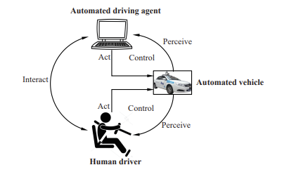
			</td>
       		<td><strong>W. Wang</strong>, et al.</td>
			<td>
				Decision-making in driver-automation shared control: A review and perspectives 
              	
 
              		[<a href="javascript:toggleInfo('wang2020decision','abstract')">Abstract</a>]
              		[<a href="javascript:toggleInfo('wang2020decision','bibtex')">BibTeX</a>] 
              		[<a href="https://ieeexplore.ieee.org/abstract/document/9146977">PDF</a>]
              		<!-- [<a href="https://www.youtube.com/watch?v=CPfXCHWMZW8">Video</a>] -->
              		<!-- [<a href="https://arxiv.org/abs/1801.02143">arXiv</a>] -->
              		<!-- [<a href="https://github.com/zhiyongc/Vehicle-Rear-Light-Data">Data</a>] -->
            	

    		</td>
 			<td>2020</td>
        	<td>IEEE/CAA Journal of Automatica Sinica</td>
        </tr>
        <tr id="abs_wang2020decision" class="abstract noshow">
        	<td colspan="5">
 <b>Abstract</b>: Shared control schemes allow a human driver to work with an automated driving agent in driver-vehicle systems while retaining the driverʼ s abilities to control. The human driver, as an essential agent in the driver-vehicle shared control systems, should be precisely modeled regarding their cognitive processes, control strategies, and decision-making processes. The interactive strategy design between drivers and automated driving agents brings an excellent challenge for human-centric driver assistance systems due to the inherent characteristics of humans. Many open-ended questions arise, such as what proper role of human drivers should act in a shared control scheme? How to make an intelligent decision capable of balancing the benefits of agents in shared control systems? Due to the advent of these attentions and questions, it is desirable to present a survey on the decision making between human drivers and highly automated vehicles, to understand their architectures, human driver modeling, and interaction strategies under the driver-vehicle shared schemes. Finally, we give a further discussion on the key future challenges and opportunities. They are likely to shape new potential research directions.
</td>
      	</tr>
      	<tr id="bib_wang2020decision" class="bibtex noshow">
        	<td colspan="5"><b>BibTeX</b>:
              	<pre>@article{wang2020decision,
                      title={Decision-making in driver-automation shared control: A review and perspectives},
                      author={Wang, Wenshuo and Na, Xiaoxiang and Cao, Dongpu and Gong, Jianwei and Xi, Junqiang and Xing, Yang and Wang, Fei-Yue},
                      journal={IEEE/CAA Journal of Automatica Sinica},
                      volume={7},
                      number={5},
                      pages={1289--1307},
                      year={2020},
                      publisher={IEEE}
                    }
                </pre>
			    </td>
      	</tr>
      <tr id="wang2020measure" class="entry">
      	<td>
				  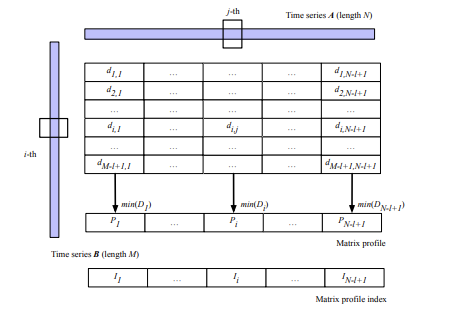
	      </td>
       	<td>
         Q. Lin, <strong>W. Wang</strong>, Y. Zhang, J. Dolan
        </td>
		    <td>
				Measuring Similarity of Interactive Driving Behaviors Using Matrix Profile 
              	
 
              		[<a href="javascript:toggleInfo('wang2020measure','abstract')">Abstract</a>]
              		[<a href="javascript:toggleInfo('wang2020measure','bibtex')">BibTeX</a>] 
              		[<a href="https://ieeexplore.ieee.org/abstract/document/9147893">PDF</a>]
              		<!-- [<a href="https://www.youtube.com/watch?v=CPfXCHWMZW8">Video</a>] -->
              		<!-- [<a href="https://arxiv.org/abs/1801.02143">arXiv</a>] -->
              		<!-- [<a href="https://github.com/zhiyongc/Vehicle-Rear-Light-Data">Data</a> -->
            	

    		</td>
 			  <td>2020</td>
        <td>IEEE American Control Conference (ACC)</td>
      </tr>
      <tr id="abs_wang2020measure" class="abstract noshow">
        <td colspan="5">
 <b>Abstract</b>: Understanding multi-vehicle interactive behaviors with temporal sequential observations is crucial for autonomous vehicles to make appropriate decisions in an uncertain traffic environment. On-demand similarity measures are significant for autonomous vehicles to deal with massive interactive driving behaviors by clustering and classifying diverse scenarios. This paper proposes a general approach for measuring spatiotemporal similarity of interactive behaviors using a multivariate matrix profile technique. The key attractive features of the approach are its reduced space and time complexity, real- time online computing for streaming traffic data, and possible capability of leveraging hardware for parallel computation. The proposed approach is validated through automatically discovering similar interactive driving behaviors at intersections from sequential data.
</td>
      </tr>
      <tr id="bib_wang2020measure" class="bibtex noshow">
        <td colspan="5"><b>BibTeX</b>:
            <pre>@inproceedings{lin2020measuring,
                    title={Measuring similarity of interactive driving behaviors using matrix profile},
                    author={Lin, Qin and Wang, Wenshuoa and Zhang, Yihuan and Dolan, John M},
                    booktitle={2020 American Control Conference (ACC)},
                    pages={3965--3970},
                    year={2020},
                    organization={IEEE}
                  }
            </pre>
			  </td>
      </tr>
      <tr id="wang2020influence" class="entry">
      	<td>
				  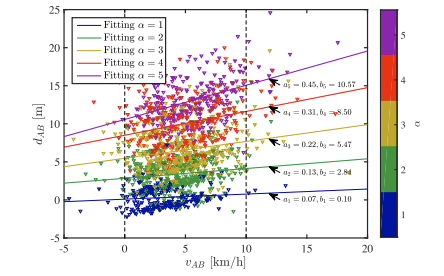
	      </td>
       	<td>
         C. Zhao, <strong>W. Wang*</strong>, S. Li, J. Gong
        </td>
		    <td>
				Influence of Cut-In Maneuvers for an Autonomous Car on Surrounding Drivers: Experiment and Analysis 
              	
 
              		[<a href="javascript:toggleInfo('wang2020influence','abstract')">Abstract</a>]
              		[<a href="javascript:toggleInfo('wang2020influence','bibtex')">BibTeX</a>] 
              		[<a href="https://ieeexplore.ieee.org/abstract/document/8715668">PDF</a>]
              		<!-- [<a href="https://www.youtube.com/watch?v=CPfXCHWMZW8">Video</a>] -->
              		<!-- [<a href="https://arxiv.org/abs/1801.02143">arXiv</a>] -->
              		<!-- [<a href="https://github.com/zhiyongc/Vehicle-Rear-Light-Data">Data</a> -->
            	

    		</td>
 			  <td>2020</td>
        <td>IEEE Transactions on Intelligent Transportation Systems</td>
      </tr>
      <tr id="abs_wang2020influence" class="abstract noshow">
        <td colspan="5">
 <b>Abstract</b>: To safely and efficiently change lanes among human drivers, autonomous vehicles (AVs) should make human-like decisions and seamlessly cooperate with surrounding vehicles. Both overaggressive and over-conservative cut-in maneuvers will have adverse effects on traffic efficiency and safety. However, it is still not entirely clear how much influence of the AV's cut-in behavior would lay on the surrounding drivers in urban traffic. To investigate this question, we design a series of driving scenarios and analyze the impact of different cut-in maneuvers performed by the human-like AV on the surrounding drivers' comfort. Ten volunteer drivers participate in our experiment and take a series of trials in a driving simulator. The experimental results demonstrate that the relative distance between the AV and the target car on the adjacent lane has a more significant effect on the surrounding drivers' comfort than the relative speed does. In addition, different parameters should be considered with different cut-in scenarios. This conclusion could provide practical support to make a friendly cut-in decision for the AVs.
</td>
      </tr>
      <tr id="bib_wang2020influence" class="bibtex noshow">
        <td colspan="5"><b>BibTeX</b>:
            <pre>@article{zhao2019influence,
                title={Influence of cut-in maneuvers for an autonomous car on surrounding drivers: experiment and analysis},
                author={Zhao, Chunqing and Wang, Wenshuo and Li, Shaopeng and Gong, Jianwei},
                journal={IEEE transactions on intelligent transportation systems},
                volume={21},
                number={6},
                pages={2266--2276},
                year={2019},
                publisher={IEEE}
              }
            </pre>
			  </td>
      </tr>
      <tr id="wang2020probabilistic" class="entry">
      	<td>
				  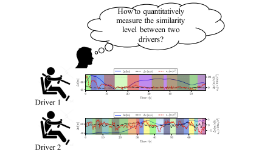
	      </td>
       	<td>
         <strong>W. Wang*</strong>, et al.
        </td>
		    <td>
				A Probabilistic Approach to Measuring Driving Behavior Similarity With Driving Primitives 
              	
 
              		[<a href="javascript:toggleInfo('wang2020probabilistic','abstract')">Abstract</a>]
              		[<a href="javascript:toggleInfo('wang2020probabilistic','bibtex')">BibTeX</a>] 
              		[<a href="https://ieeexplore.ieee.org/abstract/document/8910384">PDF</a>]
              		<!-- [<a href="https://www.youtube.com/watch?v=CPfXCHWMZW8">Video</a>] -->
              		<!-- [<a href="https://arxiv.org/abs/1801.02143">arXiv</a>] -->
              		<!-- [<a href="https://github.com/zhiyongc/Vehicle-Rear-Light-Data">Data</a> -->
            	

    		</td>
 			  <td>2020</td>
        <td>IEEE Transactions on Intelligent Vehicles</td>
      </tr>
      <tr id="abs_wang2020probabilistic" class="abstract noshow">
        <td colspan="5">
 <b>Abstract</b>: Evaluating the similarity levels of driving behavior plays a pivotal role in driving style classification and analysis, thus benefiting the design of human-centric driver assistance systems. This article presents a novel framework capable of quantitatively measuring the similarity of driving behaviors for human based on driving primitives, i.e., the building blocks of driving behavior. To this end, we develop a Bayesian nonparametric method by integrating hierarchical Dirichlet process (HDP) with a hidden Markov model (HMM) in order to automatically extract the driving primitives from sequential observations without using any prior knowledge. Then, we propose a grid-based relative entropy approach, which allows quantifying the probabilistic similarity levels among these extracted primitives. Finally, the naturalistic driving data from 10 drivers are collected to evaluate the proposed framework, with comparison to traditional work. Experimental results demonstrate that the proposed probabilistic framework based on driving primitives can provide a quantitative measurement of similar levels of driving behavior associated with the dynamic and stochastic characteristics.
</td>
      </tr>
      <tr id="bib_wang2020probabilistic" class="bibtex noshow">
        <td colspan="5"><b>BibTeX</b>:
            <pre>@article{wang2019probabilistic,
                  title={A probabilistic approach to measuring driving behavior similarity with driving primitives},
                  author={Wang, Wenshuo and Han, Wei and Na, Xiaoxiang and Gong, Jianwei and Xi, Junqiang},
                  journal={IEEE Transactions on Intelligent Vehicles},
                  volume={5},
                  number={1},
                  pages={127--138},
                  year={2019},
                  publisher={IEEE}
                }
            </pre>
			  </td>
      </tr>
      <tr id="wang2020multivehicle" class="entry">
      	<td>
				  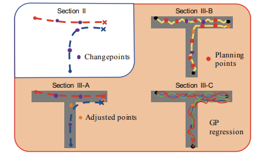
	      </td>
       	<td>
         W. Zhang, <strong>W. Wang*</strong>, J. Zhu, D. Zhao
        </td>
		    <td>
				Multi-Vehicle Interaction Scenarios Generation with Interpretable Traffic Primitives and Gaussian Process Regression 
              	
 
              		[<a href="javascript:toggleInfo('wang2020multivehicle','abstract')">Abstract</a>]
              		[<a href="javascript:toggleInfo('wang2020multivehicle','bibtex')">BibTeX</a>] 
              		[<a href="https://ieeexplore.ieee.org/abstract/document/9304568">PDF</a>]
              		<!-- [<a href="https://www.youtube.com/watch?v=CPfXCHWMZW8">Video</a>] -->
              		<!-- [<a href="https://arxiv.org/abs/1801.02143">arXiv</a>] -->
              		<!-- [<a href="https://github.com/zhiyongc/Vehicle-Rear-Light-Data">Data</a> -->
            	

    		</td>
 			  <td>2020</td>
        <td>2020 IEEE Intelligent Vehicles Symposium (IV)</td>
      </tr>
      <tr id="abs_wang2020multivehicle" class="abstract noshow">
        <td colspan="5">
 <b>Abstract</b>: Generating multi-vehicle interaction scenarios can benefit motion planning and decision making of autonomous vehicles when on-road data is insufficient. This paper presents an efficient approach to generate varied multi-vehicle interaction scenarios that can both adapt to different road geometries and inherit the key interaction patterns in real-world driving. Towards this end, the available multi-vehicle interaction scenarios are temporally segmented into several interpretable fundamental building blocks, called traffic primitives, via the Bayesian nonparametric learning. Then, the changepoints of traffic primitives are transformed into the desired road to generate collision-free interaction trajectories through a sampling-based path planning algorithm. The Gaussian process regression is finally introduced to control the variance and smoothness of the generated multi-vehicle interaction trajectories. Experiments with simulation results of three multi-vehicle trajectories at different road conditions are carried out. The experimental results demonstrate that our proposed method can generate a bunch of human-like multi-vehicle interaction trajectories that can fit different road conditions remaining the key interaction patterns of agents in the provided scenarios, which is import to the development of autonomous vehicles.
</td>
      </tr>
      <tr id="bib_wang2020multivehicle" class="bibtex noshow">
        <td colspan="5"><b>BibTeX</b>:
            <pre>@inproceedings{zhang2020multi,
                  title={Multi-vehicle interaction scenarios generation with interpretable traffic primitives and Gaussian process regression},
                  author={Zhang, Weiyang and Wang, Wenshuo and Zhu, Jiacheng and Zhao, Ding},
                  booktitle={2020 IEEE Intelligent Vehicles Symposium (IV)},
                  pages={1197--1204},
                  organization={IEEE}
                }
            </pre>
			  </td>
      </tr>
      <tr id="wang2019learning" class="entry">
      	<td>
				  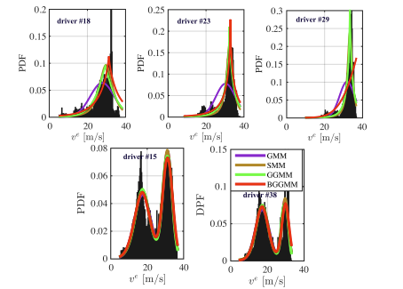
	      </td>
       	<td>
         <strong>W. Wang*</strong>, J. Xi, J. K. Hedrick
        </td>
		    <td>
				A Learning-Based Personalized Driver Model Using Bounded Generalized Gaussian Mixture Models 
              	
 
              		[<a href="javascript:toggleInfo('wang2019learning','abstract')">Abstract</a>]
              		[<a href="javascript:toggleInfo('wang2019learning','bibtex')">BibTeX</a>] 
              		[<a href="https://ieeexplore.ieee.org/abstract/document/8879516">PDF</a>]
              		<!-- [<a href="https://www.youtube.com/watch?v=CPfXCHWMZW8">Video</a>] -->
              		<!-- [<a href="https://arxiv.org/abs/1801.02143">arXiv</a>] -->
              		<!-- [<a href="https://github.com/zhiyongc/Vehicle-Rear-Light-Data">Data</a> -->
            	

    		</td>
 			  <td>2019</td>
        <td> IEEE Transactions on Vehicular Technology</td>
      </tr>
      <tr id="abs_wang2019learning" class="abstract noshow">
        <td colspan="5">
 <b>Abstract</b>: Individual driver's driving behavior plays a pivotal role in personalized driver assistance systems. Gaussian mixture models (GMM) have been widely used to fit driving data, but unsuitable for capturing the data with a long-tailed distribution. Though the generalized GMM (GGMM) could overcome this fitting issue to some extent, it still cannot handle naturalistic data which is generally bounded. This paper presents a learning-based personalized driver model that can handle non-Gaussian and bounded naturalistic driving data. To this end, we develop a BGGMM-HMM framework to model driver behavior by integrating a hidden Markov model (HMM) in a bounded GGMM (BGGMM), which synthetically includes GMM and GGMM as special cases. Further, we design an associated iterative learning algorithm to estimate the model parameters. Naturalistic car-following driving data from eight drivers are used to demonstrate the effectiveness of BGGMM-HMM. Experimental results show that the personalized driver model of BGGMM-HMM that leverages the non-Gaussian and bounded support of driving data can improve model accuracy from 23~30% over traditional GMM-based models.
</td>
      </tr>
      <tr id="bib_wang2019learning" class="bibtex noshow">
        <td colspan="5"><b>BibTeX</b>:
            <pre>@article{wang2019learning,
                  title={A learning-based personalized driver model using bounded generalized Gaussian mixture models},
                  author={Wang, Wenshuo and Xi, Junqiang and Hedrick, J Karl},
                  journal={IEEE Transactions on Vehicular Technology},
                  volume={68},
                  number={12},
                  pages={11679--11690},
                  year={2019},
                  publisher={IEEE}
                }
            </pre>
			  </td>
      </tr>
      <tr id="wang2019v2v" class="entry">
      	<td>
				  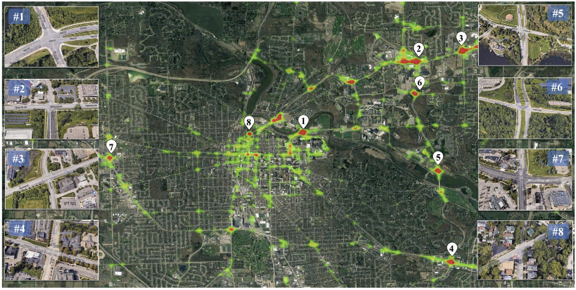
	      </td>
       	<td>
         W. Zhang, <strong>W. Wang*</strong>
        </td>
		    <td>
				Learning V2V Interactive Driving Patterns at Signalized Intersections 
              	
 
              		[<a href="javascript:toggleInfo('wang2019v2v','abstract')">Abstract</a>]
              		[<a href="javascript:toggleInfo('wang2019v2v','bibtex')">BibTeX</a>] 
              		[<a href="https://www.sciencedirect.com/science/article/pii/S0968090X18313329">PDF</a>]
              		<!-- [<a href="https://www.youtube.com/watch?v=CPfXCHWMZW8">Video</a>] -->
              		<!-- [<a href="https://arxiv.org/abs/1801.02143">arXiv</a>] -->
              		<!-- [<a href="https://github.com/zhiyongc/Vehicle-Rear-Light-Data">Data</a> -->
            	

    		</td>
 			  <td>2019</td>
        <td> Transportation Research Part C: Emerging Technologies</td>
      </tr>
      <tr id="abs_wang2019v2v" class="abstract noshow">
        <td colspan="5">
 <b>Abstract</b>: Semantic understanding of multi-vehicle interaction patterns at intersections play a pivotal role in proper decision-making of autonomous vehicles. This paper presents a flexible framework to automatically extract these interaction patterns from observed temporal sequences based on driving primitives. A Bayesian nonparametric approach is developed to segment vehicle-to-vehicle (V2V) sequential observations into small analytically interpretable components (called driving primitives) without using prior knowledge. Then, an unsupervised clustering method is developed to gather these driving primitives into groups (called driving patterns) by integrating with dynamic time warping. In addition, the extracted driving primitives are used to quantitatively analyze the similarities between behaviors at different intersections using a relative entropy metric, i.e., KullbackLeibler (KL) divergence. Finally, 706 naturalistic V2V events from eight typical urban signalized intersections are used to validate the effectiveness of the proposed primitive-based framework. Experimental results demonstrate that there exist 15 types of interactive driving patterns for V2V behaviors at intersections in our database. Moreover, the distribution of interactive driving patterns could characterize the types of intersections.
</td>
      </tr>
      <tr id="bib_wang2019v2v" class="bibtex noshow">
        <td colspan="5"><b>BibTeX</b>:
            <pre>@article{zhang2019learning,
                title={Learning V2V interactive driving patterns at signalized intersections},
                author={Zhang, Weiyang and Wang, Wenshuo},
                journal={Transportation Research Part C: Emerging Technologies},
                volume={108},
                pages={151--166},
                year={2019},
                publisher={Elsevier}
              }
            </pre>
			  </td>
      </tr>
      <tr id="wang2019time" class="entry">
      	<td>
				  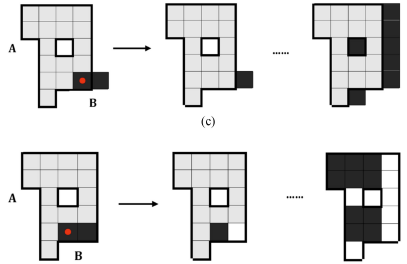
	      </td>
       	<td>
         S. Yang, <strong>W. Wang</strong>, et al.
        </td>
		    <td>
				A Time-Efficient Approach for Decision-Making Style Recognition in Lane-Changing Behavior 
              	
 
              		[<a href="javascript:toggleInfo('wang2019time','abstract')">Abstract</a>]
              		[<a href="javascript:toggleInfo('wang2019time','bibtex')">BibTeX</a>] 
              		[<a href="https://ieeexplore.ieee.org/abstract/document/8836105">PDF</a>]
              		<!-- [<a href="https://www.youtube.com/watch?v=CPfXCHWMZW8">Video</a>] -->
              		<!-- [<a href="https://arxiv.org/abs/1801.02143">arXiv</a>] -->
              		<!-- [<a href="https://github.com/zhiyongc/Vehicle-Rear-Light-Data">Data</a> -->
            	

    		</td>
 			  <td>2019</td>
        <td> IEEE Transactions on Human-Machine Systems</td>
      </tr>
      <tr id="abs_wang2019time" class="abstract noshow">
        <td colspan="5">
 <b>Abstract</b>: Fast recognition of a driver's decision-making style when changing lanes plays a pivotal role in a safety-oriented and personalized vehicle control system design. This article presents a time-efficient recognition method by integrating k-means clustering (k-MC) with the K-nearest neighbor (KNN) algorithm, called kMC-KNN. Mathematical morphology is implemented to automatically label the decision-making data into three styles (moderate, vague, and aggressive), while the integration of k-MC and the KNN algorithm helps to improve the recognition speed and accuracy. Our developed mathematical-morphology-based clustering algorithm is then validated by a comparison with agglomerative hierarchical clustering. Experimental results demonstrate that the developed kMC-KNN method, in comparison with the traditional KNN algorithm, can shorten the recognition time by more than 72.67% with a recognition accuracy of 90-98%. In addition, our developed kMCKNN method also outperforms a support vector machine in terms of recognition accuracy and stability. The developed time-efficient recognition approach would have great application potential for in-vehicle embedded solutions with restricted design specifications.
</td>
      </tr>
      <tr id="bib_wang2019time" class="bibtex noshow">
        <td colspan="5"><b>BibTeX</b>:
            <pre>@article{yang2019time,
                  title={A time-efficient approach for decision-making style recognition in lane-changing behavior},
                  author={Yang, Sen and Wang, Wenshuo and Lu, Chao and Gong, Jianwei and Xi, Junqiang},
                  journal={IEEE Transactions on Human-Machine Systems},
                  volume={49},
                  number={6},
                  pages={579--588},
                  year={2019},
                  publisher={IEEE}
                }
            </pre>
			  </td>
      </tr>
      <tr id="wang2019what" class="entry">
      	<td>
				  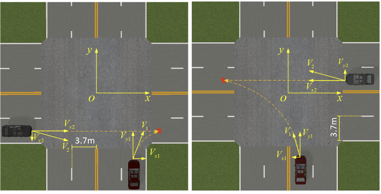
	      </td>
       	<td>
         S. Yang, <strong>W. Wang</strong>, et al.
        </td>
		    <td>
				What contributes to driving behavior prediction at unsignalized intersections? 
              	
 
              		[<a href="javascript:toggleInfo('wang2019what','abstract')">Abstract</a>]
              		[<a href="javascript:toggleInfo('wang2019what','bibtex')">BibTeX</a>] 
              		[<a href="https://www.sciencedirect.com/science/article/pii/S0968090X19312744">PDF</a>]
              		<!-- [<a href="https://www.youtube.com/watch?v=CPfXCHWMZW8">Video</a>] -->
              		<!-- [<a href="https://arxiv.org/abs/1801.02143">arXiv</a>] -->
              		<!-- [<a href="https://github.com/zhiyongc/Vehicle-Rear-Light-Data">Data</a> -->
            	

    		</td>
 			  <td>2019</td>
        <td> Transportation Research Part C: Emerging Technologies</td>
      </tr>
      <tr id="abs_wang2019what" class="abstract noshow">
        <td colspan="5">
 <b>Abstract</b>: Safely passing through unsignalized intersections (USI) in urban area is challenging for autonomous vehicles due to high uncertainties of surrounding engaged human-driven vehicles. In order to achieve this, various variables have been selected to estimate and predict the surrounding human driver's behavior. However, it is still not fully clear what variables mostly contribute to driving behavior prediction at USI. This paper investigates the contribution levels of 13 features of human driver's decision-making at USI using a random forest approach. Thirty skilled driver participants are tested in a real-time driving simulator where the traffic scenarios with merging vehicles were designed in different motion styles to mimic real traffic. The experiment results indicate that the relative distance and velocity between merging vehicles have a wider contribution range (i.e., −0.4 −0.4) than the absolute velocity and distance features (i.e., −0.2 −0.2) to predict driver behavior. The contribution also varies over the selected feature values and driving conditions. This contribution research gains insight in the influence of different variables on driver behavior prediction at USI, thereby assisting researchers in selecting representative features in self-driving applications.
</td>
      </tr>
      <tr id="bib_wang2019what" class="bibtex noshow">
        <td colspan="5"><b>BibTeX</b>:
            <pre>@article{yang2019contributes,
                  title={What contributes to driving behavior prediction at unsignalized intersections?},
                  author={Yang, Shun and Wang, Wenshuo and Jiang, Yuande and Wu, Jian and Zhang, Sumin and Deng, Weiwen},
                  journal={Transportation research part C: emerging technologies},
                  volume={108},
                  pages={100--114},
                  year={2019},
                  publisher={Elsevier}
                }
            </pre>
			  </td>
      </tr>
      <tr id="wang2019modeling" class="entry">
      	<td>
				  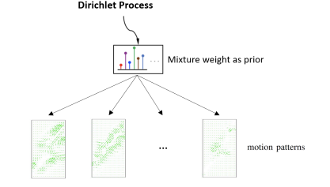
	      </td>
       	<td>
         Y. Guo, V.V. Kalidindi, M. Arief, <strong>W. Wang</strong>, et al.
        </td>
		    <td>
				Modeling Multi-Vehicle Interaction Scenarios Using Gaussian Random Field 
              	
 
              		[<a href="javascript:toggleInfo('wang2019modeling','abstract')">Abstract</a>]
              		[<a href="javascript:toggleInfo('wang2019modeling','bibtex')">BibTeX</a>] 
              		[<a href="https://ieeexplore.ieee.org/abstract/document/8917516">PDF</a>]
              		<!-- [<a href="https://www.youtube.com/watch?v=CPfXCHWMZW8">Video</a>] -->
              		<!-- [<a href="https://arxiv.org/abs/1801.02143">arXiv</a>] -->
              		<!-- [<a href="https://github.com/zhiyongc/Vehicle-Rear-Light-Data">Data</a> -->
            	

    		</td>
 			  <td>2019</td>
        <td> IEEE Intelligent Transportation Systems Conference (ITSC)</td>
      </tr>
      <tr id="abs_wang2019modeling" class="abstract noshow">
        <td colspan="5">
 <b>Abstract</b>: Autonomous vehicles are expected to navigate in complex traffic scenarios with multiple surrounding vehicles. The correlations between road users vary over time, the degree of which, in theory, could be infinitely large, thus posing a great challenge in modeling and predicting the driving environment. In this paper, we propose a method to model multi-vehicle interactions using a stochastic vector field model and apply non-parametric Bayesian learning to extract the underlying motion patterns from a large quantity of naturalistic traffic data. We then use this model to reproduce the high-dimensional driving scenarios in a finitely tractable form. We use a Gaussian process to model multi-vehicle motion, and a Dirichlet process to assign each observation to a specific scenario. We verify the effectiveness of the proposed method on highway and intersection datasets from the NGSIM project, in which complex multi-vehicle interactions are prevalent. The results show that the proposed method can capture motion patterns from both settings, without imposing heroic prior, and hence demonstrate the potential application for a wide array of traffic situations. The proposed modeling method could enable simulation platforms and other testing methods designed for autonomous vehicle evaluation, to easily model and generate traffic scenarios emulating large scale driving data.
</td>
      </tr>
      <tr id="bib_wang2019modeling" class="bibtex noshow">
        <td colspan="5"><b>BibTeX</b>:
            <pre>@inproceedings{guo2019modeling,
                  title={Modeling multi-vehicle interaction scenarios using gaussian random field},
                  author={Guo, Yaohui and Kalidindi, Vinay Varma and Arief, Mansur and Wang, Wenshuo and Zhu, Jiacheng and Peng, Huei and Zhao, Ding},
                  booktitle={2019 IEEE Intelligent Transportation Systems Conference (ITSC)},
                  pages={3974--3980},
                  year={2019},
                  organization={IEEE}
                }
            </pre>
			  </td>
      </tr>
      <tr id="wang2019general" class="entry">
      	<td>
				  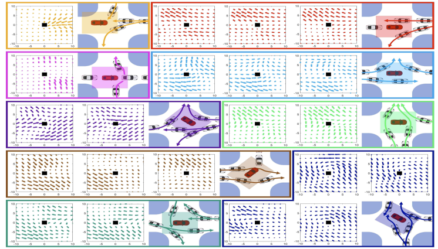
	      </td>
       	<td>
         C. Zhang, J. Zhu, <strong>W. Wang</strong>, et al.
        </td>
		    <td>
				A General Framework of Learning Multi-Vehicle Interaction Patterns from Video 
              	
 
              		[<a href="javascript:toggleInfo('wang2019general','abstract')">Abstract</a>]
              		[<a href="javascript:toggleInfo('wang2019general','bibtex')">BibTeX</a>] 
              		[<a href="https://ieeexplore.ieee.org/abstract/document/8917212">PDF</a>]
              		<!-- [<a href="https://www.youtube.com/watch?v=CPfXCHWMZW8">Video</a>] -->
              		<!-- [<a href="https://arxiv.org/abs/1801.02143">arXiv</a>] -->
              		<!-- [<a href="https://github.com/zhiyongc/Vehicle-Rear-Light-Data">Data</a> -->
            	

    		</td>
 			  <td>2019</td>
        <td> IEEE Intelligent Transportation Systems Conference (ITSC)</td>
      </tr>
      <tr id="abs_wang2019general" class="abstract noshow">
        <td colspan="5">
 <b>Abstract</b>: Semantic learning and understanding of multi-vehicle interaction patterns in a cluttered driving environment are essential but challenging for autonomous vehicles to make proper decisions. This paper presents a general framework to gain insights into intricate multi-vehicle interaction patterns from bird's-eye view traffic videos. We adopt a Gaussian velocity field to describe the time-varying multi-vehicle interaction behaviors and then use deep autoencoders to learn associated latent representations for each temporal frame. Then, we utilize a hidden semi-Markov model with a hierarchical Dirichlet process as a prior to segment these sequential representations into granular components, also called traffic primitives, corresponding to interaction patterns. Experimental results demonstrate that our proposed framework can extract traffic primitives from videos, thus providing a semantic way to analyze multi-vehicle interaction patterns, even for cluttered driving scenarios that are far messier than human beings can cope with.
</td>
      </tr>
      <tr id="bib_wang2019general" class="bibtex noshow">
        <td colspan="5"><b>BibTeX</b>:
            <pre>@inproceedings{zhang2019general,
                  title={A general framework of learning multi-vehicle interaction patterns from video},
                  author={Zhang, Chengyuan and Zhu, Jiacheng and Wang, Wenshuo and Zhao, Ding},
                  booktitle={2019 IEEE Intelligent Transportation Systems Conference (ITSC)},
                  pages={4323--4328},
                  year={2019},
                  organization={IEEE}
                }
            </pre>
			  </td>
      </tr>
      <tr id="wang2019recurrent" class="entry">
      	<td>
				  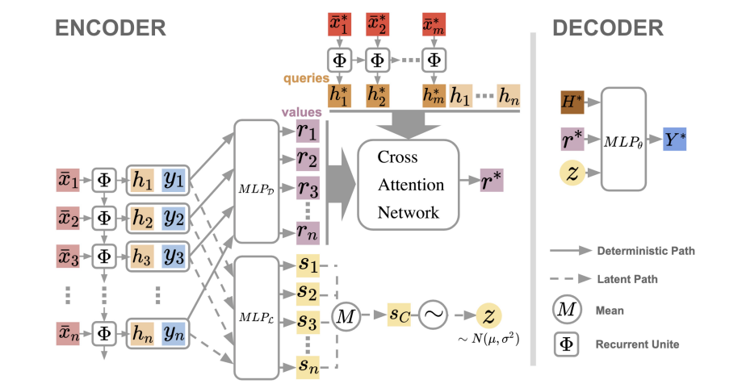
	      </td>
       	<td>
         S. Qin, J. Zhu, J. Qin, <strong>W. Wang*</strong>, et al.
        </td>
		    <td>
				Recurrent attentive neural process for sequential data 
              	
 
              		[<a href="javascript:toggleInfo('wang2019recurrent','abstract')">Abstract</a>]
              		[<a href="javascript:toggleInfo('wang2019recurrent','bibtex')">BibTeX</a>] 
              		<!-- [<a href="https://ieeexplore.ieee.org/abstract/document/8917212">PDF</a>] -->
              		<!-- [<a href="https://www.youtube.com/watch?v=CPfXCHWMZW8">Video</a>] -->
              		[<a href="https://arxiv.org/abs/1910.09323">arXiv</a>]
              		<!-- [<a href="https://github.com/zhiyongc/Vehicle-Rear-Light-Data">Data</a> -->
            	

    		</td>
 			  <td>2019</td>
        <td> NeuraIPS Workshop</td>
      </tr>
      <tr id="abs_wang2019recurrent" class="abstract noshow">
        <td colspan="5">
 <b>Abstract</b>: Neural processes (NPs) learn stochastic processes and predict the distribution of target output adaptively conditioned on a context set of observed input-output pairs. Furthermore, Attentive Neural Process (ANP) improved the prediction accuracy of NPs by incorporating attention mechanism among contexts and targets. In a number of real-world applications such as robotics, finance, speech, and biology, it is critical to learn the temporal order and recurrent structure from sequential data. However, the capability of NPs capturing these properties is limited due to its permutation invariance instinct. In this paper, we proposed the Recurrent Attentive Neural Process (RANP), or alternatively, Attentive Neural Process-RecurrentNeural Network(ANP-RNN), in which the ANP is incorporated into a recurrent neural network. The proposed model encapsulates both the inductive biases of recurrent neural networks and also the strength of NPs for modelling uncertainty. We demonstrate that RANP can effectively model sequential data and outperforms NPs and LSTMs remarkably in a 1D regression toy example as well as autonomous-driving applications.
</td>
      </tr>
      <tr id="bib_wang2019recurrent" class="bibtex noshow">
        <td colspan="5"><b>BibTeX</b>:
            <pre>@article{qin2019recurrent,
                  title={Recurrent attentive neural process for sequential data},
                  author={Qin, Shenghao and Zhu, Jiacheng and Qin, Jimmy and Wang, Wenshuo and Zhao, Ding},
                  journal={arXiv preprint arXiv:1910.09323},
                  year={2019}
                }
            </pre>
			  </td>
      </tr>
      <tr id="wang2019probabilistic" class="entry">
      	<td>
				  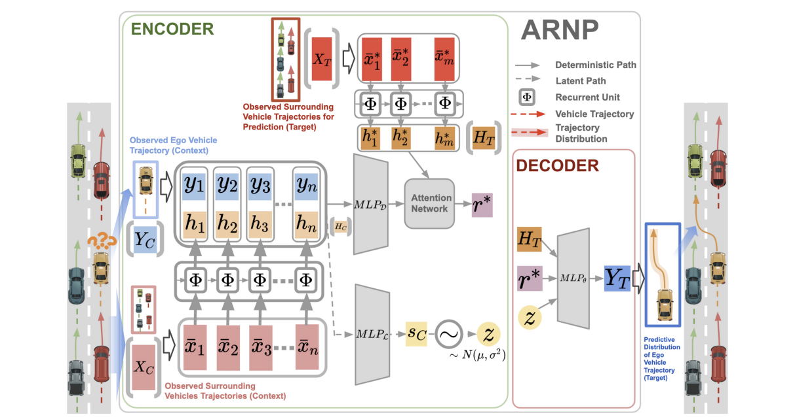
	      </td>
       	<td>
         J. Zhu, S. Qin, <strong>W. Wang*</strong>, et al.
        </td>
		    <td>
				Probabilistic Trajectory Prediction for Autonomous Vehicles with Attentive Recurrent Neural Process 
              	
 
              		[<a href="javascript:toggleInfo('wang2019probabilistic','abstract')">Abstract</a>]
              		[<a href="javascript:toggleInfo('wang2019probabilistic','bibtex')">BibTeX</a>] 
              		<!-- [<a href="https://ieeexplore.ieee.org/abstract/document/8917212">PDF</a>] -->
              		<!-- [<a href="https://www.youtube.com/watch?v=CPfXCHWMZW8">Video</a>] -->
              		[<a href="https://arxiv.org/abs/1910.08102">arXiv</a>]
              		<!-- [<a href="https://github.com/zhiyongc/Vehicle-Rear-Light-Data">Data</a> -->
            	

    		</td>
 			  <td>2019</td>
        <td> NeuraIPS Workshop</td>
      </tr>
      <tr id="abs_wang2019probabilistic" class="abstract noshow">
        <td colspan="5">
 <b>Abstract</b>: Predicting surrounding vehicle behaviors are critical to autonomous vehicles when negotiating in multi-vehicle interaction scenarios. Most existing approaches require tedious training process with large amounts of data and may fail to capture the propagating uncertainty in interaction behaviors. The multi-vehicle behaviors are assumed to be generated from a stochastic process. This paper proposes an attentive recurrent neural process (ARNP) approach to overcome the above limitations, which uses a neural process (NP) to learn a distribution of multi-vehicle interaction behavior. Our proposed model inherits the flexibility of neural networks while maintaining Bayesian probabilistic characteristics. Constructed by incorporating NPs with recurrent neural networks (RNNs), the ARNP model predicts the distribution of a target vehicle trajectory conditioned on the observed long-term sequential data of all surrounding vehicles. This approach is verified by learning and predicting lane-changing trajectories in complex traffic scenarios. Experimental results demonstrate that our proposed method outperforms previous counterparts in terms of accuracy and uncertainty expressiveness. Moreover, the meta-learning instinct of NPs enables our proposed ARNP model to capture global information of all observations, thereby being able to adapt to new targets efficiently.
</td>
      </tr>
      <tr id="bib_wang2019probabilistic" class="bibtex noshow">
        <td colspan="5"><b>BibTeX</b>:
            <pre>@article{zhu2019probabilistic,
                  title={Probabilistic trajectory prediction for autonomous vehicles with attentive recurrent neural process},
                  author={Zhu, Jiacheng and Qin, Shenghao and Wang, Wenshuo and Zhao, Ding},
                  journal={arXiv preprint arXiv:1910.08102},
                  year={2019}
                }
            </pre>
			  </td>
      </tr>
      <tr id="wang2019driver" class="entry">
      	<td>
				  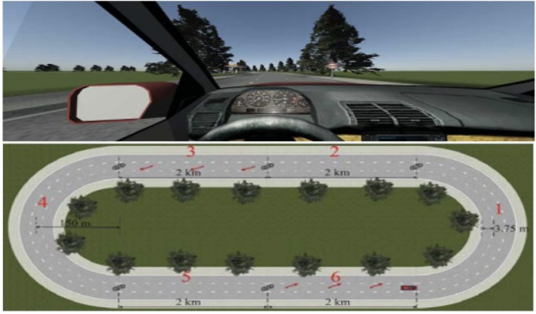
	      </td>
       	<td>
         S. Yang, J. Xi, <strong>W. Wang</strong>
        </td>
		    <td>
				Driver Drowsiness Detection through a Vehicle's Active Probe Action 
              	
 
              		[<a href="javascript:toggleInfo('wang2019driver','abstract')">Abstract</a>]
              		[<a href="javascript:toggleInfo('wang2019driver','bibtex')">BibTeX</a>] 
              		[<a href="https://ieeexplore.ieee.org/abstract/document/8887773">PDF</a>]
              		<!-- [<a href="https://www.youtube.com/watch?v=CPfXCHWMZW8">Video</a>] -->
              		<!-- [<a href="https://arxiv.org/abs/1910.08102">arXiv</a>] -->
              		<!-- [<a href="https://github.com/zhiyongc/Vehicle-Rear-Light-Data">Data</a> -->
            	

    		</td>
 			  <td>2019</td>
        <td> IEEE 2nd Connected and Automated Vehicles Symposium (CAVS)</td>
      </tr>
      <tr id="abs_wang2019driver" class="abstract noshow">
        <td colspan="5">
 <b>Abstract</b>: Drowsy driving is one of the major causes of traffic collisions, injuries, and fatalities. Existing literature primarily detects driver drowsiness by passively monitoring lanes, steering angles, behavioral states, and physiological states. The paper presents an approach towards enabling vehicles to detect driver drowsiness through the vehicle's active probe action actively. To this end, we record and analyze drivers' responses to a slight active left-lane drifting action of the vehicle in a driving simulator. According to drivers' responses, six indicators of drowsiness are extracted and then used to detect driver drowsiness with three recognition methods, i.e., support vector machine, Gaussian kernel density estimation, and back- propagation neural networks, in comparison to traditional monitoring features regarding steering- wheel movement. Experimental results demonstrate that our proposed active probe approach outperforms the traditional monitor methods for driver drowsiness detection with an accuracy of 97.50%, precision of 95%, and specificity of 98.21%. The proposed active driver drowsiness detection could facilitate a new development of active safety systems.
</td>
      </tr>
      <tr id="bib_wang2019driver" class="bibtex noshow">
        <td colspan="5"><b>BibTeX</b>:
            <pre>@inproceedings{yang2019driver,
                  title={Driver drowsiness detection through a vehicle's active probe action},
                  author={Yang, Sen and Xi, Junqiang and Wang, Wenshuo},
                  booktitle={2019 IEEE 2nd Connected and Automated Vehicles Symposium (CAVS)},
                  pages={1--7},
                  year={2019},
                  organization={IEEE}
                }
            </pre>
			  </td>
      </tr>
      <tr id="wang2019estimating" class="entry">
      	<td>
				  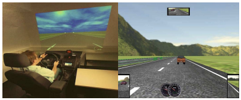
	      </td>
       	<td>
         X. Li, <strong>W. Wang*</strong>, M. Roetting
        </td>
		    <td>
				Estimating driver’s lane-change intent considering driving style and contextual traffic 
              	
 
              		[<a href="javascript:toggleInfo('wang2019estimating','abstract')">Abstract</a>]
              		[<a href="javascript:toggleInfo('wang2019estimating','bibtex')">BibTeX</a>] 
              		[<a href="https://ieeexplore.ieee.org/abstract/document/8500333">PDF</a>]
              		<!-- [<a href="https://www.youtube.com/watch?v=CPfXCHWMZW8">Video</a>] -->
              		<!-- [<a href="https://arxiv.org/abs/1910.08102">arXiv</a>] -->
              		<!-- [<a href="https://github.com/zhiyongc/Vehicle-Rear-Light-Data">Data</a> -->
            	

    		</td>
 			  <td>2019</td>
        <td> IEEE Transactions on Intelligent Transportation Systems</td>
      </tr>
      <tr id="abs_wang2019estimating" class="abstract noshow">
        <td colspan="5">
 <b>Abstract</b>: Estimating a driver's lane-change (LC) intent is very important so as to avoid traffic accidents caused by improper LC maneuvers. This paper proposes a lane-change Bayesian network (LCBN) incorporated with a Gaussian mixture model (GMM), termed as LCBN-GMM, to estimate a driver's LC intent considering a driver's driving style over varying scenarios. According to the scores made by participates with a behavioral-psychological questionnaire, three driving styles are classified. In order to get more effective labeled LC and lane-keep (LK) data for model training, we propose a gaze-based labeling (GBL) method by monitoring a drivers's gaze behavior, instead of using a time-window labeling method. The capability of LCBN-GMM to estimate a driver's lane-change intent is evaluated in different LC scenarios and driving styles, in comparison to support vector machine and Naive Bayes. Data are collected in a seat-box-based driving simulator where 32 drivers, consisting of 9 aggressive, 15 neutral, and 8 conservative drivers, participated. Experimental results demonstrate that the LCBN-GMM with GBL achieves the best performance, estimating a driver's LC intent an average of 4.5 s ahead of actual LC maneuvers with 78.2% accuracy considering both driving style and contextual traffic, compared with other approaches.
</td>
      </tr>
      <tr id="bib_wang2019estimating" class="bibtex noshow">
        <td colspan="5"><b>BibTeX</b>:
            <pre>@article{li2018estimating,
                  title={Estimating driver’s lane-change intent considering driving style and contextual traffic},
                  author={Li, Xiaohan and Wang, Wenshuo and Roetting, Matthias},
                  journal={IEEE Transactions on Intelligent Transportation Systems},
                  volume={20},
                  number={9},
                  pages={3258--3271},
                  year={2018},
                  publisher={IEEE}
                }
            </pre>
			  </td>
      </tr>
      <tr id="wang2019driving" class="entry">
      	<td>
				  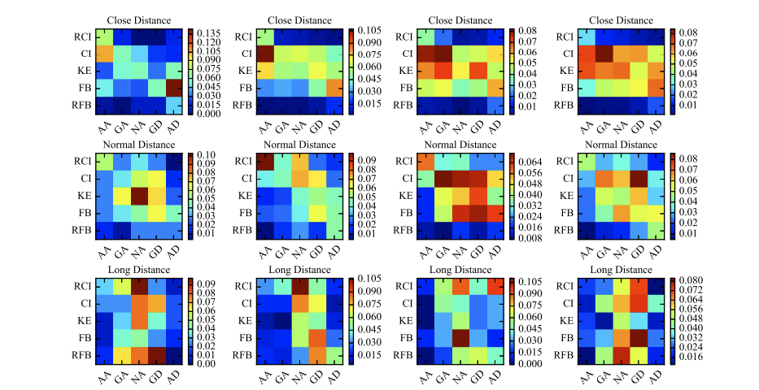
	      </td>
       	<td>
         <strong>W. Wang</strong>, J. Xi, D. Zhao
        </td>
		    <td>
				Driving Style Analysis Using Primitive Driving Patterns With Bayesian Nonparametric Approaches 
              	
 
              		[<a href="javascript:toggleInfo('wang2019driving','abstract')">Abstract</a>]
              		[<a href="javascript:toggleInfo('wang2019driving','bibtex')">BibTeX</a>] 
              		[<a href="https://ieeexplore.ieee.org/abstract/document/8506402">PDF</a>]
              		<!-- [<a href="https://www.youtube.com/watch?v=CPfXCHWMZW8">Video</a>] -->
              		<!-- [<a href="https://arxiv.org/abs/1910.08102">arXiv</a>] -->
              		<!-- [<a href="https://github.com/zhiyongc/Vehicle-Rear-Light-Data">Data</a> -->
            	

    		</td>
 			  <td>2019</td>
        <td> IEEE Transactions on Intelligent Transportation Systems</td>
      </tr>
      <tr id="abs_wang2019driving" class="abstract noshow">
        <td colspan="5">
 <b>Abstract</b>: Driving style analysis plays a pivotal role in intelligent vehicle design. This paper presents a novel framework for driving style analysis based on primitive driving patterns. To this end, a Bayesian nonparametric approach based on a hidden semi-Markov model (HSMM) is introduced to extract the primitive driving patterns from muti-dimensional time-series driving data without prior knowledge of these driving patterns. For the Bayesian nonparametric approach, a hierarchical Dirichlet process (HDP) is applied to learn the unknown smooth dynamical modes in the HSMM, called primitive driving patterns. Two other types of Bayesian nonparametric approaches (HDP-HMM and sticky HDP-HMM) are developed as comparatives in order to show the advantages of the HDP-HSMM. The naturalistic car-following data of 18 drivers are collected from the University of Michigan Safety Pilot Model Deployment database. For each driver, 75 primitive driving patterns are semantically predefined according to their physical and psychological perception thresholds. The individual driving styles are then semantically analyzed based on the distribution over primitive driving patterns, and the similarity of driving styles among drivers is then evaluated. Experimental results demonstrate that the utilization of driving primitive pattern provides a semantically interpretable way to analyze driver's behavior and driving style.
</td>
      </tr>
      <tr id="bib_wang2019driving" class="bibtex noshow">
        <td colspan="5"><b>BibTeX</b>:
            <pre>@article{wang2018driving,
                  title={Driving style analysis using primitive driving patterns with Bayesian nonparametric approaches},
                  author={Wang, Wenshuo and Xi, Junqiang and Zhao, Ding},
                  journal={IEEE Transactions on Intelligent Transportation Systems},
                  volume={20},
                  number={8},
                  pages={2986--2998},
                  year={2018},
                  publisher={IEEE}
                }
            </pre>
			  </td>
      </tr>
      <tr id="wang2019trajectory" class="entry">
      	<td>
				  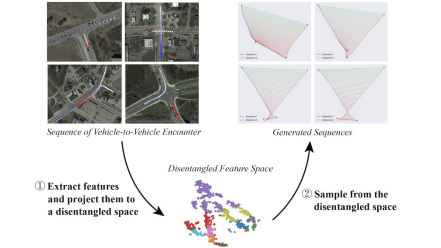
	      </td>
       	<td>
         W. Ding, <strong>W. Wang</strong>, D. Zhao
        </td>
		    <td>
				A multi-vehicle trajectories generator to simulate vehicle-to-vehicle encountering scenarios 
              	
 
              		[<a href="javascript:toggleInfo('wang2019trajectory','abstract')">Abstract</a>]
              		[<a href="javascript:toggleInfo('wang2019trajectory','bibtex')">BibTeX</a>] 
              		[<a href="https://ieeexplore.ieee.org/abstract/document/8793776">PDF</a>]
              		<!-- [<a href="https://www.youtube.com/watch?v=CPfXCHWMZW8">Video</a>] -->
              		<!-- [<a href="https://arxiv.org/abs/1910.08102">arXiv</a>] -->
              		<!-- [<a href="https://github.com/zhiyongc/Vehicle-Rear-Light-Data">Data</a> -->
            	

    		</td>
 			  <td>2019</td>
        <td> International Conference on Robotics and Automation (ICRA) </td>
      </tr>
      <tr id="abs_wang2019trajectory" class="abstract noshow">
        <td colspan="5">
 <b>Abstract</b>: Generating multi-vehicle trajectories from existing limited data can provide rich resources for autonomous vehicle development and testing. This paper introduces a multi-vehicle trajectory generator (MTG) that can encode multi-vehicle interaction scenarios (called driving encounters) into an interpretable representation from which new driving encounter scenarios are generated by sampling. The MTG consists of a bi-directional encoder and a multi-branch decoder. A new disentanglement metric is then developed for model analyses and comparisons in terms of model robustness and the independence of the latent codes. Comparison of our proposed MTG with β-VAE and InfoGAN demonstrates that the MTG has stronger capability to purposely generate rational vehicle-to-vehicle encounters through operating the disentangled latent codes. Thus the MTG could provide more data for engineers and researchers to develop testing and evaluation scenarios for autonomous vehicles.
</td>
      </tr>
      <tr id="bib_wang2019trajectory" class="bibtex noshow">
        <td colspan="5"><b>BibTeX</b>:
            <pre>@inproceedings{ding2019multi,
                    title={A multi-vehicle trajectories generator to simulate vehicle-to-vehicle encountering scenarios},
                    author={Ding, Wenhao and Wang, Wenshuo and Zhao, Ding},
                    booktitle={2019 International Conference on Robotics and Automation (ICRA)},
                    pages={4255--4261},
                    year={2019},
                    organization={IEEE}
                  }
            </pre>
			  </td>
      </tr>
      <tr id="wang2019scene" class="entry">
      	<td>
				  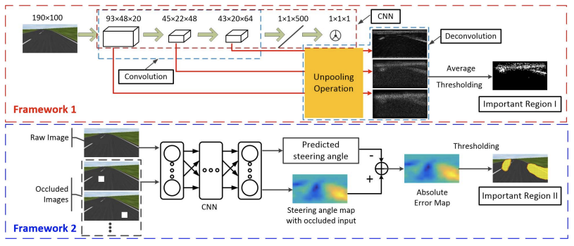
	      </td>
       	<td>
         S. Yang, <strong>W. Wang</strong>, C. Liu, W. Deng
        </td>
		    <td>
				A multi-vehicle trajectories generator to simulate vehicle-to-vehicle encountering scenarios 
              	
 
              		[<a href="javascript:toggleInfo('wang2019scene','abstract')">Abstract</a>]
              		[<a href="javascript:toggleInfo('wang2019scene','bibtex')">BibTeX</a>] 
              		[<a href="https://ieeexplore.ieee.org/abstract/document/8480450">PDF</a>]
              		<!-- [<a href="https://www.youtube.com/watch?v=CPfXCHWMZW8">Video</a>] -->
              		<!-- [<a href="https://arxiv.org/abs/1910.08102">arXiv</a>] -->
              		<!-- [<a href="https://github.com/zhiyongc/Vehicle-Rear-Light-Data">Data</a> -->
            	

    		</td>
 			  <td>2019</td>
        <td> IEEE Transactions on Systems, Man, and Cybernetics: Systems  </td>
      </tr>
      <tr id="abs_wang2019scene" class="abstract noshow">
        <td colspan="5">
 <b>Abstract</b>: Deep learning techniques have been widely used in autonomous driving community for the purpose of environment perception. Recently, it starts being adopted for learning end-to-end controllers for complex driving scenarios. However, the complexity and nonlinearity of the network architecture limits its interpretability to understand driving scenarios and judge the importance of certain visual regions in sensory scenes. In this paper, based on the convolutional neural network (CNN), we propose two complementary frameworks to automatically determine the most contributive regions of the input scenes, offering intuitive knowledge of how a trained end-to-end autonomous vehicle controller understands driving scenarios. In the first framework, a feature map-based method is proposed by leveraging current progress in CNN visualization, in which the deconvolution approach recovers the feature maps to extract features that contribute most to understand driving scenes. In the second framework, the importance level of regions is ranked using the error map between the labeled and predicted control inputs generated by occluding different parts of input scenes, thus providing a pixel-wise rank of importance. Test data sets with extracted contributive regions are input to the CNN controller. Then, different CNN controllers trained with the new data sets preprocessed using our proposed frameworks are verified via closed-loop tests. Results show that both the features identified from the first framework and the regions identified from the second framework are of crucial importance to scene understanding for the controller and can significantly affect the performance of CNN controllers.
</td>
      </tr>
      <tr id="bib_wang2019scene" class="bibtex noshow">
        <td colspan="5"><b>BibTeX</b>:
            <pre>@article{yang2018scene,
                  title={Scene understanding in deep learning-based end-to-end controllers for autonomous vehicles},
                  author={Yang, Shun and Wang, Wenshuo and Liu, Chang and Deng, Weiwen},
                  journal={IEEE Transactions on Systems, Man, and Cybernetics: Systems},
                  volume={49},
                  number={1},
                  pages={53--63},
                  year={2018},
                  publisher={IEEE}
                }
            </pre>
			  </td>
      </tr>
      <tr id="wang2019statistical" class="entry">
      	<td>
				  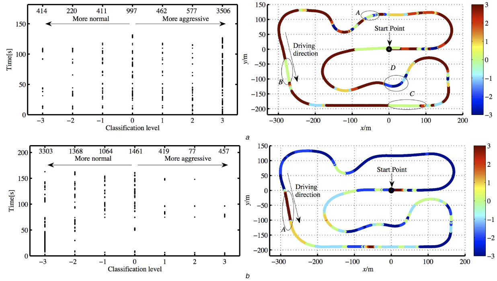
	      </td>
       	<td>
         W. Han, <strong>W. Wang*</strong>, X. Li, J. Xi
        </td>
		    <td>
				Statistical-based approach for driving style recognition using Bayesian probability with kernel density estimation 
              	
 
              		[<a href="javascript:toggleInfo('wang2019statistical','abstract')">Abstract</a>]
              		[<a href="javascript:toggleInfo('wang2019statistical','bibtex')">BibTeX</a>] 
              		[<a href="https://ietresearch.onlinelibrary.wiley.com/doi/full/10.1049/iet-its.2017.0379">PDF</a>]
              		<!-- [<a href="https://www.youtube.com/watch?v=CPfXCHWMZW8">Video</a>] -->
              		<!-- [<a href="https://arxiv.org/abs/1910.08102">arXiv</a>] -->
              		<!-- [<a href="https://github.com/zhiyongc/Vehicle-Rear-Light-Data">Data</a> -->
            	

    		</td>
 			  <td>2019</td>
        <td> IET Intelligent Transportation Systems  </td>
      </tr>
      <tr id="abs_wang2019statistical" class="abstract noshow">
        <td colspan="5">
 <b>Abstract</b>: Driving style recognition plays a crucial role in eco-driving, road safety, and intelligent vehicle control. This study proposes a statistical-based recognition method to deal with driver behaviour uncertainty in driving style recognition. First, the authors extract discriminative features using the conditional kernel density function to characterise path-following behaviour. Meanwhile, the posterior probability of each selected feature is computed based on the full Bayesian theory. Second, they develop an efficient Euclidean distance-based method to recognise the path-following style for new input datasets at a low computational cost. By comparing the Euclidean distance of each pair of elements in the feature vector, then they classify driving styles into seven levels from normal to aggressive. Finally, they employ a cross-validation method to evaluate the utility of their proposed approach by comparing with a fuzzy logic (FL) method. The experiment results show that the proposed statistical-based recognition method integrating with the kernel density is more efficient and robust than the FL method.
</td>
      </tr>
      <tr id="bib_wang2019statistical" class="bibtex noshow">
        <td colspan="5"><b>BibTeX</b>:
            <pre>@article{han2019statistical,
                  title={Statistical-based approach for driving style recognition using Bayesian probability with kernel density estimation},
                  author={Han, Wei and Wang, Wenshuo and Li, Xiaohan and Xi, Junqiang},
                  journal={IET Intelligent Transport Systems},
                  volume={13},
                  number={1},
                  pages={22--30},
                  year={2019},
                  publisher={Wiley Online Library}
                }
            </pre>
			  </td>
      </tr>
      <tr id="wang2018effects" class="entry">
      	<td>
				  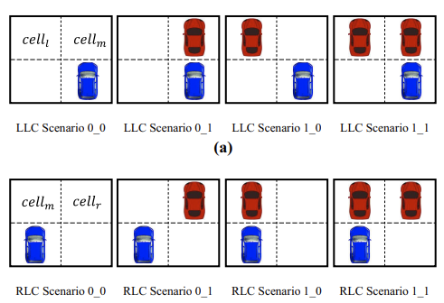
	      </td>
       	<td>
         X. Li, <strong>W. Wang*</strong>, Z. Zhang, M. Rotting
        </td>
		    <td>
				Effects of feature selection on lane-change maneuver recognition: an analysis of naturalistic driving data 
              	
 
              		[<a href="javascript:toggleInfo('wang2018effects','abstract')">Abstract</a>]
              		[<a href="javascript:toggleInfo('wang2018effects','bibtex')">BibTeX</a>] 
              		[<a href="https://www.emerald.com/insight/content/doi/10.1108/JICV-09-2018-0010/full/html">PDF</a>]
              		<!-- [<a href="https://www.youtube.com/watch?v=CPfXCHWMZW8">Video</a>] -->
              		<!-- [<a href="https://arxiv.org/abs/1910.08102">arXiv</a>] -->
              		<!-- [<a href="https://github.com/zhiyongc/Vehicle-Rear-Light-Data">Data</a> -->
            	

    		</td>
 			  <td>2018</td>
        <td> Journal of Intelligent and Connected Vehicles  </td>
      </tr>
      <tr id="abs_wang2018effects" class="abstract noshow">
        <td colspan="5">
 <b>Abstract</b>: Feature selection is crucial for machine learning to recognize lane-change (LC) maneuver as there exist a large number of feature candidates. Blindly using feature could take up large storage and excessive computation time, while insufficient feature selection would cause poor performance. Selecting high contributive features to classify LC and lane-keep behavior is effective for maneuver recognition. This paper aims to propose a feature selection method from a statistical view based on an analysis from naturalistic driving data.
</td>
      </tr>
      <tr id="bib_wang2018effects" class="bibtex noshow">
        <td colspan="5"><b>BibTeX</b>:
            <pre>@article{li2018effects,
                  title={Effects of feature selection on lane-change maneuver recognition: an analysis of naturalistic driving data},
                  author={Li, Xiaohan and Wang, Wenshuo and Zhang, Zhang and R{\"o}tting, Matthias},
                  journal={Journal of intelligent and connected vehicles},
                  year={2018},
                  publisher={Emerald Publishing Limited}
                }
            </pre>
			  </td>
      </tr>
      <tr id="wang2018HEV" class="entry">
      	<td>
				  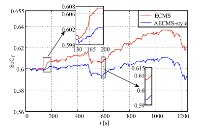
	      </td>
       	<td>
         S. Yang, <strong>W. Wang*</strong>, F. Zhang, et al.
        </td>
		    <td>
				Driving-Style-Oriented Adaptive Equivalent Consumption Minimization Strategies for HEVs 
              	
 
              		[<a href="javascript:toggleInfo('wang2018HEV','abstract')">Abstract</a>]
              		[<a href="javascript:toggleInfo('wang2018HEV','bibtex')">BibTeX</a>] 
              		[<a href="https://ieeexplore.ieee.org/abstract/document/8410451">PDF</a>]
              		<!-- [<a href="https://www.youtube.com/watch?v=CPfXCHWMZW8">Video</a>] -->
              		<!-- [<a href="https://arxiv.org/abs/1910.08102">arXiv</a>] -->
              		<!-- [<a href="https://github.com/zhiyongc/Vehicle-Rear-Light-Data">Data</a> -->
            	

    		</td>
 			  <td>2018</td>
        <td> IEEE Transactions on Vehicular Technology  </td>
      </tr>
      <tr id="abs_wang2018HEV" class="abstract noshow">
        <td colspan="5">
 <b>Abstract</b>: The performance of energy management systems in hybrid electric vehicles (HEVs) is highly related to drivers’ driving style. This paper proposes a driving-style-oriented adaptive equivalent consumption minimization strategy (AECMS-style) in order to improve fuel economy for HEVs. For this purpose, first, a statistical pattern recognition approach is proposed to classify drivers into six groups from moderate to aggressive using kernel density estimation and entropy theory. Then, the effects of driving style on energy management strategies are discussed by analyzing the performance of the equivalent consumption minimization strategy (ECMS). Based on the comprehensive analysis, we design a new optimal equivalent factor adjustment rule for the AECMS-style and also redesign the braking strategy of motors at driving charging mode for different driving styles. Finally, five drivers with typical driving styles participate in experiments to show the effectiveness of our proposed method. Experimental results demonstrate that the AECMS-style can improve the fuel economy and charging sustainability of HEVs, compared with ECMS.
</td>
      </tr>
      <tr id="bib_wang2018HEV" class="bibtex noshow">
        <td colspan="5"><b>BibTeX</b>:
            <pre>@article{yang2018driving,
                  title={Driving-style-oriented adaptive equivalent consumption minimization strategies for HEVs},
                  author={Yang, Sen and Wang, Wenshuo and Zhang, Fengqi and Hu, Yuhui and Xi, Junqiang},
                  journal={IEEE Transactions on Vehicular Technology},
                  volume={67},
                  number={10},
                  pages={9249--9261},
                  year={2018},
                  publisher={IEEE}
                }
            </pre>
			  </td>
      </tr>
      <tr id="wang2018lane" class="entry">
      	<td>
				  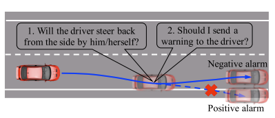
	      </td>
       	<td>
         <strong>W. Wang</strong>, et al.
        </td>
		    <td>
				A Learning-Based Approach for Lane Departure Warning Systems With a Personalized Driver Model 
              	
 
              		[<a href="javascript:toggleInfo('wang2018lane','abstract')">Abstract</a>]
              		[<a href="javascript:toggleInfo('wang2018lane','bibtex')">BibTeX</a>] 
              		[<a href="https://ieeexplore.ieee.org/abstract/document/8408761">PDF</a>]
              		<!-- [<a href="https://www.youtube.com/watch?v=CPfXCHWMZW8">Video</a>] -->
              		<!-- [<a href="https://arxiv.org/abs/1910.08102">arXiv</a>] -->
              		<!-- [<a href="https://github.com/zhiyongc/Vehicle-Rear-Light-Data">Data</a> -->
            	

    		</td>
 			  <td>2018</td>
        <td> IEEE Transactions on Vehicular Technology  </td>
      </tr>
      <tr id="abs_wang2018lane" class="abstract noshow">
        <td colspan="5">
 <b>Abstract</b>: Misunderstanding of driver correction behaviors is the primary reason for false warnings of lane-departure-prediction systems. We proposed a learning-based approach to predict unintended lane-departure behaviors and chances of drivers to bring vehicles back to the lane. First, a personalized driver model for lane-departure and lane-keeping behavior is established by combining the Gaussian mixture model and the hidden Markov model. Second, based on this model, we developed an online model-based prediction algorithm to predict the forthcoming vehicle trajectory and judge whether the driver will act a lane departure behavior or correction behavior. We also develop a warning strategy based on the model-based prediction algorithm that allows the lane-departure warning system to be acceptable for drivers according to the predicted trajectory. In addition, the naturalistic driving data of ten drivers were collected to train the personalized driver model and validate this approach. We compared the proposed method with a basic time-to-lane-crossing (TLC) method and a TLC-directional sequence of piecewise lateral slopes (TLC-DSPLS) method. Experimental results show that the proposed approach can reduce the false-warning rate to 3.13% on average at 1-s prediction time.
</td>
      </tr>
      <tr id="bib_wang2018lane" class="bibtex noshow">
        <td colspan="5"><b>BibTeX</b>:
            <pre>@article{wang2018learning,
                  title={A learning-based approach for lane departure warning systems with a personalized driver model},
                  author={Wang, Wenshuo and Zhao, Ding and Han, Wei and Xi, Junqiang},
                  journal={IEEE Transactions on Vehicular Technology},
                  volume={67},
                  number={10},
                  pages={9145--9157},
                  year={2018},
                  publisher={IEEE}
                }
            </pre>
			  </td>
      </tr>
      <tr id="wang2018lidar" class="entry">
      	<td>
				  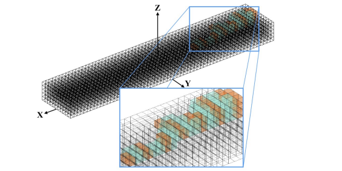
	      </td>
       	<td>
         S. Mou, Y. Chang, <strong>W. Wang</strong>, et al.
        </td>
		    <td>
				An Optimal LiDAR Configuration Approach for Self-Driving Cars 
              	
 
              		[<a href="javascript:toggleInfo('wang2018lidar','abstract')">Abstract</a>]
              		[<a href="javascript:toggleInfo('wang2018lidar','bibtex')">BibTeX</a>] 
              		<!-- [<a href="https://ieeexplore.ieee.org/abstract/document/8408761">PDF</a>] -->
              		<!-- [<a href="https://www.youtube.com/watch?v=CPfXCHWMZW8">Video</a>] -->
              		[<a href="https://arxiv.org/abs/1805.07843">arXiv</a>]
              		<!-- [<a href="https://github.com/zhiyongc/Vehicle-Rear-Light-Data">Data</a> -->
            	

    		</td>
 			  <td>2018</td>
        <td> ArXiv  </td>
      </tr>
      <tr id="abs_wang2018lidar" class="abstract noshow">
        <td colspan="5">
 <b>Abstract</b>: LiDARs plays an important role in self-driving cars and its configuration such as the location placement for each LiDAR can influence object detection performance. This paper aims to investigate an optimal configuration that maximizes the utility of on-hand LiDARs. First, a perception model of LiDAR is built based on its physical attributes. Then a generalized optimization model is developed to find the optimal configuration, including the pitch angle, roll angle, and position of LiDARs. In order to fix the optimization issue with off-the-shelf solvers, we proposed a lattice-based approach by segmenting the LiDAR's range of interest into finite subspaces, thus turning the optimal configuration into a nonlinear optimization problem. A cylinder-based method is also proposed to approximate the objective function, thereby making the nonlinear optimization problem solvable. A series of simulations are conducted to validate our proposed method. This proposed approach to optimal LiDAR configuration can provide a guideline to researchers to maximize the utility of LiDARs.
</td>
      </tr>
      <tr id="bib_wang2018lidar" class="bibtex noshow">
        <td colspan="5"><b>BibTeX</b>:
            <pre>@article{mou2018optimal,
                  title={An optimal lidar configuration approach for self-driving cars},
                  author={Mou, Shenyu and Chang, Yan and Wang, Wenshuo and Zhao, Ding},
                  journal={arXiv preprint arXiv:1805.07843},
                  year={2018}
                }
            </pre>
			  </td>
      </tr>
      <tr id="wang2018unify" class="entry">
      	<td>
				  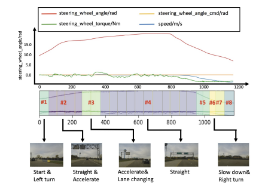
	      </td>
       	<td>
         J. Zhu, <strong>W. Wang</strong>, et al.
        </td>
		    <td>
				A Tempt to Unify Heterogeneous Driving Databases using Traffic Primitives 
              	
 
              		[<a href="javascript:toggleInfo('wang2018unify','abstract')">Abstract</a>]
              		[<a href="javascript:toggleInfo('wang2018unify','bibtex')">BibTeX</a>] 
              		[<a href="https://ieeexplore.ieee.org/abstract/document/8569940">PDF</a>]
              		<!-- [<a href="https://www.youtube.com/watch?v=CPfXCHWMZW8">Video</a>] -->
              		<!-- [<a href="https://arxiv.org/abs/1805.07843">arXiv</a>] -->
              		<!-- [<a href="https://github.com/zhiyongc/Vehicle-Rear-Light-Data">Data</a> -->
            	

    		</td>
 			  <td>2018</td>
        <td> 21st International Conference on Intelligent Transportation Systems (ITSC) </td>
      </tr>
      <tr id="abs_wang2018unify" class="abstract noshow">
        <td colspan="5">
 <b>Abstract</b>: A multitude of publicly-available driving datasets and data platforms have been raised for autonomous vehicles (AV). However, the heterogeneities of databases in size, structure and driving context make existing datasets practically ineffective due to a lack of uniform frameworks and searchable indexes. In order to overcome these limitations on existing public datasets, this paper proposes a data unification framework based on traffic primitives with ability to automatically unify and label heterogeneous traffic data. This is achieved by two steps: 1) Carefully arrange raw multidimensional time series driving data into a relational database and then 2) automatically extract labeled and indexed traffic primitives from traffic data through a Bayesian nonparametric learning method. Finally, we evaluate the effectiveness of our developed framework using the collected real vehicle data.
</td>
      </tr>
      <tr id="bib_wang2018unify" class="bibtex noshow">
        <td colspan="5"><b>BibTeX</b>:
            <pre>@inproceedings{zhu2018tempt,
                  title={A tempt to unify heterogeneous driving databases using traffic primitives},
                  author={Zhu, Jiacheng and Wang, Wenshuo and Zhao, Ding},
                  booktitle={2018 21st International Conference on Intelligent Transportation Systems (ITSC)},
                  pages={2052--2057},
                  year={2018},
                  organization={IEEE}
                }
            </pre>
			  </td>
      </tr>
      <tr id="wang2018brake" class="entry">
      	<td>
				  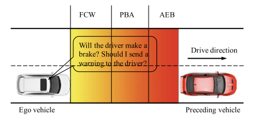
	      </td>
       	<td>
         <strong>W. Wang</strong>, et al.
        </td>
		    <td>
				Learning and Inferring a Driver's Braking Action in Car-Following Scenarios 
              	
 
              		[<a href="javascript:toggleInfo('wang2018brake','abstract')">Abstract</a>]
              		[<a href="javascript:toggleInfo('wang2018brake','bibtex')">BibTeX</a>] 
              		[<a href="https://ieeexplore.ieee.org/abstract/document/8259345">PDF</a>]
              		<!-- [<a href="https://www.youtube.com/watch?v=CPfXCHWMZW8">Video</a>] -->
              		<!-- [<a href="https://arxiv.org/abs/1805.07843">arXiv</a>] -->
              		<!-- [<a href="https://github.com/zhiyongc/Vehicle-Rear-Light-Data">Data</a> -->
            	

    		</td>
 			  <td>2018</td>
        <td> IEEE Transactions on Vehicular Technology </td>
      </tr>
      <tr id="abs_wang2018brake" class="abstract noshow">
        <td colspan="5">
 <b>Abstract</b>: Accurately predicting and inferring a driver's decision to brake is critical for designing warning systems and avoiding collisions. In this paper, we focus on predicting a driver's intent to brake in car-following scenarios from a perception-decision-action perspective according to his/her driving history. A learning-based inference method, using onboard data from CAN-Bus, radar, and cameras as explanatory variables, is introduced to infer drivers' braking decisions by combining a Gaussian mixture model (GMM) with a hidden Markov model (HMM). The GMM is used to model stochastic relationships among variables, while the HMM is applied to infer drivers' braking actions based on the GMM. Real-case driving data from 49 drivers (more than three years' driving data per driver on average) have been collected from the University of Michigan Safety Pilot Model Deployment database. We compare the GMM-HMM method to a support vector machine (SVM) method and a SVM-Bayesian filtering method. The experimental results are evaluated by employing three performance metrics: accuracy, sensitivity, and specificity. The comparison results show that the GMM-HMM obtains the best performance, with an accuracy of 90%, sensitivity of 84%, and specificity of 97%. Thus, we believe that this method has great potential for real-world active safety systems.
</td>
      </tr>
      <tr id="bib_wang2018brake" class="bibtex noshow">
        <td colspan="5"><b>BibTeX</b>:
            <pre>@article{wang2018learning,
                  title={Learning and inferring a driver's braking action in car-following scenarios},
                  author={Wang, Wenshuo and Xi, Junqiang and Zhao, Ding},
                  journal={IEEE Transactions on Vehicular Technology},
                  volume={67},
                  number={5},
                  pages={3887--3899},
                  year={2018},
                  publisher={IEEE}
                }
            </pre>
			  </td>
      </tr>
      <tr id="wang2018extracting" class="entry">
      	<td>
				  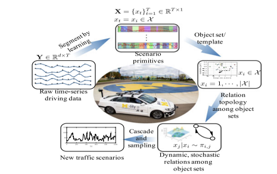
	      </td>
       	<td>
         <strong>W. Wang</strong>, D. Zhao
        </td>
		    <td>
				Extracting Traffic Primitives Directly From Naturalistically Logged Data for Self-Driving Applications 
              	
 
              		[<a href="javascript:toggleInfo('wang2018extracting','abstract')">Abstract</a>]
              		[<a href="javascript:toggleInfo('wang2018extracting','bibtex')">BibTeX</a>] 
              		[<a href="https://ieeexplore.ieee.org/abstract/document/8260870">PDF</a>]
              		<!-- [<a href="https://www.youtube.com/watch?v=CPfXCHWMZW8">Video</a>] -->
              		<!-- [<a href="https://arxiv.org/abs/1805.07843">arXiv</a>] -->
              		<!-- [<a href="https://github.com/zhiyongc/Vehicle-Rear-Light-Data">Data</a> -->
            	

    		</td>
 			  <td>2018</td>
        <td> IEEE Robotics and Automation Letters </td>
      </tr>
      <tr id="abs_wang2018extracting" class="abstract noshow">
        <td colspan="5">
 <b>Abstract</b>: Developing an automated vehicle, that can handle complicated driving scenarios and appropriately interact with other road users, requires the ability to semantically learn and understand driving environment, oftentimes, based on analyzing massive amounts of naturalistic driving data. An important paradigm that allows automated vehicles to both learn from human drivers and gain insights is understanding the principal compositions of the entire traffic, termed as traffic primitives. However, the exploding data growth presents a great challenge in extracting primitives from high-dimensional time-series traffic data with various types of road users engaged. Therefore, automatically extracting primitives is becoming one of the cost-efficient ways to help autonomous vehicles understand and predict the complex traffic scenarios. In addition, the extracted primitives from raw data should 1) be appropriate for automated driving applications and also 2) be easily used to generate new traffic scenarios. However, existing literature does not provide a method to automatically learn these primitives from large-scale traffic data. The contribution of this letter has two manifolds. The first one is that we proposed a new framework to generate new traffic scenarios from a handful of limited traffic data. The second one is that, we introduce a nonparametric Bayesian learning method-a sticky hierarchical Dirichlet process hidden Markov model-to automatically extract primitives from multidimensional traffic data without prior knowledge of the primitive settings. The developed method is then validated using one day of naturalistic driving data. Experiment results show that the nonparametric Bayesian learning method is able to extract primitives from traffic scenarios where both the binary and continuous events coexist.
</td>
      </tr>
      <tr id="bib_wang2018extracting" class="bibtex noshow">
        <td colspan="5"><b>BibTeX</b>:
            <pre>@article{wang2018extracting,
                  title={Extracting traffic primitives directly from naturalistically logged data for self-driving applications},
                  author={Wang, Wenshuo and Zhao, Ding},
                  journal={IEEE Robotics and Automation Letters},
                  volume={3},
                  number={2},
                  pages={1223--1229},
                  year={2018},
                  publisher={IEEE}
                }
            </pre>
			  </td>
      </tr>
      <tr id="wang2017style" class="entry">
      	<td>
				  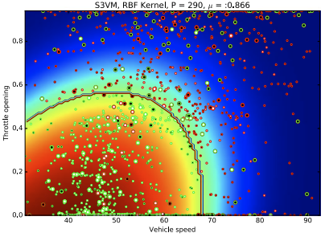
	      </td>
       	<td>
         <strong>W. Wang</strong>, et al.
        </td>
		    <td>
				Driving Style Classification Using a Semisupervised Support Vector Machine 
              	
 
              		[<a href="javascript:toggleInfo('wang2017style','abstract')">Abstract</a>]
              		[<a href="javascript:toggleInfo('wang2017style','bibtex')">BibTeX</a>] 
              		[<a href="https://ieeexplore.ieee.org/abstract/document/8015191">PDF</a>]
              		<!-- [<a href="https://www.youtube.com/watch?v=CPfXCHWMZW8">Video</a>] -->
              		<!-- [<a href="https://arxiv.org/abs/1805.07843">arXiv</a>] -->
              		<!-- [<a href="https://github.com/zhiyongc/Vehicle-Rear-Light-Data">Data</a> -->
            	

    		</td>
 			  <td>2017</td>
        <td>  IEEE Transactions on Human-Machine Systems  </td>
      </tr>
      <tr id="abs_wang2017style" class="abstract noshow">
        <td colspan="5">
 <b>Abstract</b>: Supervised learning approaches are widely used for driving style classification; however, they often require a large amount of labeled training data, which is usually scarce in a real-world setting. Moreover, it is time-consuming to manually label huge amounts of driving data due to uncertainties of driver behavior and variances among the data analysts. To address this problem, a semisupervised approach, a semisupervised support vector machine (S3VM), is employed to classify drivers into aggressive and normal styles based on a few labeled data points. First, a few data clusters are selected and manually labeled using a k-means clustering method. Then, a specific differentiable surrogate of a loss function is developed, which makes it feasible to use standard optimization tools to solve the nonconvex optimization problem. One of the most popular quasi-Newton algorithms is then used to assign the optimal label to all of the training data. Finally, we compare the S3VM method with a support vector machine method for classifying driving styles from different amounts of labeled data. Experiments show that the S3VM method can improve the classification accuracy by about 10% and reduce the labeling effort by using only a few labeled data clusters among huge amounts of unlabeled data.
</td>
      </tr>
      <tr id="bib_wang2017style" class="bibtex noshow">
        <td colspan="5"><b>BibTeX</b>:
            <pre>@article{wang2017driving,
                  title={Driving style classification using a semisupervised support vector machine},
                  author={Wang, Wenshuo and Xi, Junqiang and Chong, Alexandre and Li, Lin},
                  journal={IEEE Transactions on Human-Machine Systems},
                  volume={47},
                  number={5},
                  pages={650--660},
                  year={2017},
                  publisher={IEEE}
                }
            </pre>
			  </td>
      </tr>
      <tr id="wang2017evaluation" class="entry">
      	<td>
				  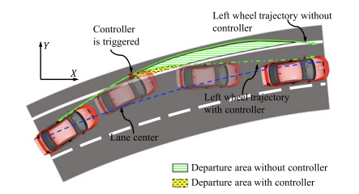
	      </td>
       	<td>
         <strong>W. Wang</strong>, D. Zhao
        </td>
		    <td>
				Evaluation of Lane Departure Correction Systems Using a Regenerative Stochastic Driver Model 
              	
 
              		[<a href="javascript:toggleInfo('wang2017evaluation','abstract')">Abstract</a>]
              		[<a href="javascript:toggleInfo('wang2017evaluation','bibtex')">BibTeX</a>] 
              		[<a href="https://ieeexplore.ieee.org/abstract/document/8049298">PDF</a>]
              		<!-- [<a href="https://www.youtube.com/watch?v=CPfXCHWMZW8">Video</a>] -->
              		<!-- [<a href="https://arxiv.org/abs/1805.07843">arXiv</a>] -->
              		<!-- [<a href="https://github.com/zhiyongc/Vehicle-Rear-Light-Data">Data</a> -->
            	

    		</td>
 			  <td>2017</td>
        <td>  IEEE Transactions on Intelligent Vehicles  </td>
      </tr>
      <tr id="abs_wang2017evaluation" class="abstract noshow">
        <td colspan="5">
 <b>Abstract</b>: Evaluating the effectiveness and benefits of driver assistance systems is crucial for improving the system performance. In this paper, we propose a novel framework for testing and evaluating lane departure correction systems at a low cost by using lane departure events reproduced from naturalistic driving data. First, 529 096 lane departure events were extracted from the Safety Pilot Model Deployment database collected by the University of Michigan Transportation Research Institute. Second, a stochastic lane departure model consisting of eight random key variables was developed to reduce the dimension of the data description and improve the computational efficiency. With this purpose, we used a bounded Gaussian mixture model to describe drivers' stochastic lane departure behaviors. Then, a lane departure correction system with an aim point controller was designed, and a batch of lane departure events was reproduced from the learned stochastic driver model. Finally, we assessed the developed evaluation approach by comparing lateral departure areas of vehicles between with and without correction controllers. The simulation results show that the proposed method can effectively evaluate lane departure correction systems.
</td>
      </tr>
      <tr id="bib_wang2017evaluation" class="bibtex noshow">
        <td colspan="5"><b>BibTeX</b>:
            <pre>@article{wang2017evaluation,
                  title={Evaluation of lane departure correction systems using a regenerative stochastic driver model},
                  author={Wang, Wenshuo and Zhao, Ding},
                  journal={IEEE Transactions on Intelligent Vehicles},
                  volume={2},
                  number={3},
                  pages={221--232},
                  year={2017},
                  publisher={IEEE}
                }
            </pre>
			  </td>
      </tr>
      <tr id="wang2017how" class="entry">
      	<td>
				  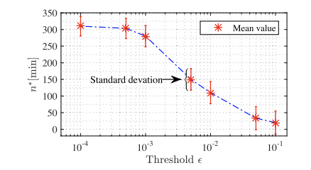
	      </td>
       	<td>
         <strong>W. Wang</strong>, C. Liu, D. Zhao
        </td>
		    <td>
				How Much Data Are Enough? A Statistical Approach With Case Study on Longitudinal Driving Behavior 
              	
 
              		[<a href="javascript:toggleInfo('wang2017how','abstract')">Abstract</a>]
              		[<a href="javascript:toggleInfo('wang2017how','bibtex')">BibTeX</a>] 
              		[<a href="https://ieeexplore.ieee.org/abstract/document/7959200">PDF</a>]
              		<!-- [<a href="https://www.youtube.com/watch?v=CPfXCHWMZW8">Video</a>] -->
              		<!-- [<a href="https://arxiv.org/abs/1805.07843">arXiv</a>] -->
              		<!-- [<a href="https://github.com/zhiyongc/Vehicle-Rear-Light-Data">Data</a> -->
            	

    		</td>
 			  <td>2017</td>
        <td>  IEEE Transactions on Intelligent Vehicles  </td>
      </tr>
      <tr id="abs_wang2017how" class="abstract noshow">
        <td colspan="5">
 <b>Abstract</b>: Big data has shown its uniquely powerful ability to reveal, model, and understand driver behaviors. The amount of data affects the experiment cost and conclusions in the analysis. Insufficient data may lead to inaccurate models, whereas excessive data lead to waste resources. For projects that cost millions of dollars, it is critical to determine the right amount of data needed. However, how to decide the appropriate amount has not been fully studied in the realm of driver behaviors. This paper systematically investigates this issue to estimate how much naturalistic driving data (NDD) is needed for understanding driver behaviors from a statistical point of view. A general assessment method is proposed using a Gaussian kernel density estimation to catch the underlying characteristics of driver behaviors. We then apply the Kullback-Leibler divergence method to measure the similarity between density functions with differing amounts of NDD. A max-minimum approach is used to compute the appropriate amount of NDD. To validate our proposed method, we investigated the car-following case using NDD collected from the University of Michigan Safety Pilot Model Deployment program. We demonstrate that from a statistical perspective, the proposed approach can provide an appropriate amount of NDD capable of capturing most features of the normal car-following behavior, which is consistent with the experiment settings in many literatures.
</td>
      </tr>
      <tr id="bib_wang2017how" class="bibtex noshow">
        <td colspan="5"><b>BibTeX</b>:
            <pre>@article{wang2017much,
                  title={How much data are enough? A statistical approach with case study on longitudinal driving behavior},
                  author={Wang, Wenshuo and Liu, Chang and Zhao, Ding},
                  journal={IEEE Transactions on Intelligent Vehicles},
                  volume={2},
                  number={2},
                  pages={85--98},
                  year={2017},
                  publisher={IEEE}
                }
            </pre>
			  </td>
      </tr>
      <tr id="wang2017feature" class="entry">
      	<td>
				  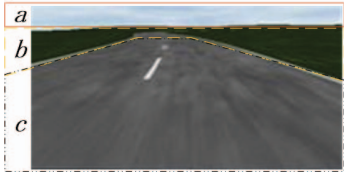
	      </td>
       	<td>
         S. Yang, <strong>W. Wang</strong>, C. Liu, W. Deng, J. K. Hedrick
        </td>
		    <td>
				Feature analysis and selection for training an end-to-end autonomous vehicle controller using deep learning approach 
              	
 
              		[<a href="javascript:toggleInfo('wang2017feature','abstract')">Abstract</a>]
              		[<a href="javascript:toggleInfo('wang2017feature','bibtex')">BibTeX</a>] 
              		[<a href="https://ieeexplore.ieee.org/abstract/document/7995850">PDF</a>]
              		<!-- [<a href="https://www.youtube.com/watch?v=CPfXCHWMZW8">Video</a>] -->
              		<!-- [<a href="https://arxiv.org/abs/1805.07843">arXiv</a>] -->
              		<!-- [<a href="https://github.com/zhiyongc/Vehicle-Rear-Light-Data">Data</a> -->
            	

    		</td>
 			  <td>2017</td>
        <td>  IEEE Intelligent Vehicles Symposium (IV)  </td>
      </tr>
      <tr id="abs_wang2017feature" class="abstract noshow">
        <td colspan="5">
 <b>Abstract</b>: Deep learning-based approaches have been widely used for training controllers for autonomous vehicles due to their powerful ability to approximate nonlinear functions or policies. However, the training process usually requires large labeled data sets and takes a lot of time. In this paper, we analyze the influences of features on the performance of controllers trained using the convolutional neural networks (CNNs), which gives a guideline of feature selection to reduce computation cost. We collect a large set of data using The Open Racing Car Simulator (TORCS) and classify the image features into three categories (sky-related, roadside-related, and road-related features). We then design two experimental frameworks to investigate the importance of each single feature for training a CNN controller. The first framework uses the training data with all three features included to train a controller, which is then tested with data that has one feature removed to evaluate the feature's effects. The second framework is trained with the data that has one feature excluded, while all three features are included in the test data. Different driving scenarios are selected to test and analyze the trained controllers using the two experimental frameworks. The experiment results show that (1) the road-related features are indispensable for training the controller, (2) the roadside-related features are useful to improve the generalizability of the controller to scenarios with complicated roadside information, and (3) the sky-related features have limited contribution to train an end-to-end autonomous vehicle controller.
</td>
      </tr>
      <tr id="bib_wang2017how" class="bibtex noshow">
        <td colspan="5"><b>BibTeX</b>:
            <pre>@inproceedings{yang2017feature,
                  title={Feature analysis and selection for training an end-to-end autonomous vehicle controller using deep learning approach},
                  author={Yang, Shun and Wang, Wenshuo and Liu, Chang and Deng, Weiwen and Hedrick, J Karl},
                  booktitle={2017 IEEE Intelligent Vehicles Symposium (IV)},
                  pages={1033--1038},
                  year={2017},
                  organization={IEEE}
                }
            </pre>
			  </td>
      </tr>
      <tr id="wang2017develop" class="entry">
      	<td>
				  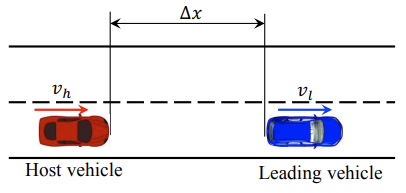
	      </td>
       	<td>
         <strong>W. Wang</strong>, D. Zhao, J. Xi, D. LeBlanc, J. K. Hedrick
        </td>
		    <td>
				Development and evaluation of two learning-based personalized driver models for car-following behaviors 
              	
 
              		[<a href="javascript:toggleInfo('wang2017develop','abstract')">Abstract</a>]
              		[<a href="javascript:toggleInfo('wang2017develop','bibtex')">BibTeX</a>] 
              		[<a href="https://ieeexplore.ieee.org/abstract/document/7963105">PDF</a>]
              		<!-- [<a href="https://www.youtube.com/watch?v=CPfXCHWMZW8">Video</a>] -->
              		<!-- [<a href="https://arxiv.org/abs/1805.07843">arXiv</a>] -->
              		<!-- [<a href="https://github.com/zhiyongc/Vehicle-Rear-Light-Data">Data</a> -->
            	

    		</td>
 			  <td>2017</td>
        <td>  IEEE American Control Conference (ACC)  </td>
      </tr>
      <tr id="abs_wang2017develop" class="abstract noshow">
        <td colspan="5">
 <b>Abstract</b>: Personalized driver models play a key role in the development of advanced driver assistance systems and automated driving systems. Traditionally, physical-based driver models with fixed structures usually lack the flexibility to describe the uncertainties and high non-linearity of driver behaviors. In this paper, two kinds of learning-based car-following personalized driver models were developed using naturalistic driving data collected from the University of Michigan Safety Pilot Model Deployment program. One model is developed by combining the Gaussian Mixture Model (GMM) and the Hidden Markov Model (HMM), and the other one is developed by combining the Gaussian Mixture Model (GMM) and Probability Density Functions (PDF). Fitting results between the two approaches were analyzed with different model inputs and numbers of GMM components. Statistical analyses show that both models provide good performance of fitting while the GMM-PDF approach shows a higher potential to increase the model accuracy given a higher dimension of training data.
</td>
      </tr>
      <tr id="bib_wang2017develop" class="bibtex noshow">
        <td colspan="5"><b>BibTeX</b>:
            <pre>@inproceedings{wang2017development,
                  title={Development and evaluation of two learning-based personalized driver models for car-following behaviors},
                  author={Wang, Wenshuo and Zhao, Ding and Xi, Junqiang and LeBlanc, David J and Hedrick, J Karl},
                  booktitle={2017 American Control Conference (ACC)},
                  pages={1133--1138},
                  year={2017},
                  organization={IEEE}
                }
            </pre>
			  </td>
      </tr>
      <tr id="wang2017human" class="entry">
      	<td>
				  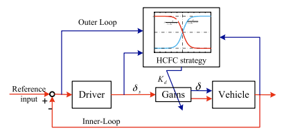
	      </td>
       	<td>
         <strong>W. Wang</strong>, J. Xi, C. Liu, X. Li
        </td>
		    <td>
				Human-Centered Feed-Forward Control of a Vehicle Steering System Based on a Driver's Path-Following Characteristics 
              	
 
              		[<a href="javascript:toggleInfo('wang2017human','abstract')">Abstract</a>]
              		[<a href="javascript:toggleInfo('wang2017human','bibtex')">BibTeX</a>] 
              		[<a href="https://ieeexplore.ieee.org/abstract/document/7576705">PDF</a>]
              		<!-- [<a href="https://www.youtube.com/watch?v=CPfXCHWMZW8">Video</a>] -->
              		<!-- [<a href="https://arxiv.org/abs/1805.07843">arXiv</a>] -->
              		<!-- [<a href="https://github.com/zhiyongc/Vehicle-Rear-Light-Data">Data</a> -->
            	

    		</td>
 			  <td>2017</td>
        <td>  IEEE Transactions on Intelligent Transportation Systems  </td>
      </tr>
      <tr id="abs_wang2017human" class="abstract noshow">
        <td colspan="5">
 <b>Abstract</b>: To improve vehicle path-following performance and to reduce driver workload, a human-centered feed-forward control (HCFC) system for a vehicle steering system is proposed. To be specific, a novel dynamic control strategy for the steering ratio of vehicle steering systems that treats vehicle speed, lateral deviation, yaw error, and steering angle as the inputs and a driver's expected steering ratio as the output is developed. To determine the parameters of the proposed dynamic control strategy, drivers are classified into three types according to the level of sensitivity to errors, i.e., low, middle, and high. The proposed HCFC system offers a human-centered steering system (HCSS) with a tunable steering gain, which can assist drivers in tracking a given path with smaller steering wheel angles and change rate of the angle by adaptively adjusting steering ratio according to driver's path-following characteristics, reducing the driver's workload. A series of experiments of tracking the centerline of double lane change (DLC) are conducted in CarSim and three different types of drivers are subsequently selected to test in a portable driving simulator under a fixed-speed condition. The simulation and experiment results show that the proposed HCSS with the dynamic control strategy, as compared with the classical control strategy of steering ratio, can improve task performance by about 7% and reduce the driver's physical workload and mental workload by about 35% and 50%, respectively, when following the given path.
</td>
      </tr>
      <tr id="bib_wang2017human" class="bibtex noshow">
        <td colspan="5"><b>BibTeX</b>:
            <pre>@article{wang2016human,
                    title={Human-centered feed-forward control of a vehicle steering system based on a driver's path-following characteristics},
                    author={Wang, Wenshuo and Xi, Junqiang and Liu, Chang and Li, Xiaohan},
                    journal={IEEE transactions on intelligent transportation systems},
                    volume={18},
                    number={6},
                    pages={1440--1453},
                    year={2016},
                    publisher={IEEE}
                  }
            </pre>
			  </td>
      </tr>
      <tr id="wang2016review" class="entry">
      	<td>
				  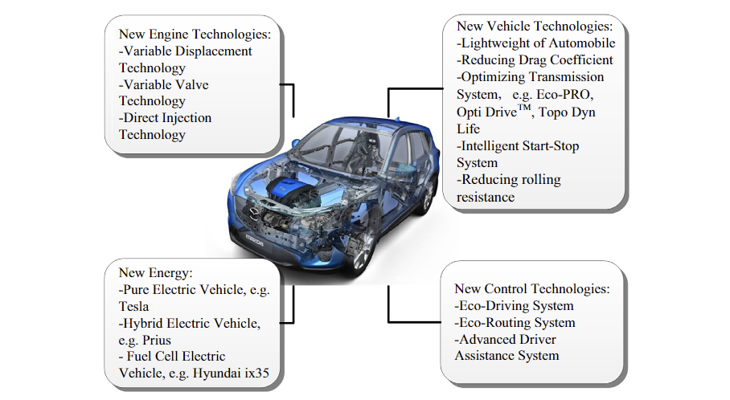
	      </td>
       	<td>
         M. Zhou, H. Jin, <strong>W. Wang*</strong>
        </td>
		    <td>
				A review of vehicle fuel consumption models to evaluate eco-driving and eco-routing 
              	
 
              		[<a href="javascript:toggleInfo('wang2016review','abstract')">Abstract</a>]
              		[<a href="javascript:toggleInfo('wang2016review','bibtex')">BibTeX</a>] 
              		[<a href="https://www.sciencedirect.com/science/article/pii/S1361920916306009">PDF</a>]
              		<!-- [<a href="https://www.youtube.com/watch?v=CPfXCHWMZW8">Video</a>] -->
              		<!-- [<a href="https://arxiv.org/abs/1805.07843">arXiv</a>] -->
              		<!-- [<a href="https://github.com/zhiyongc/Vehicle-Rear-Light-Data">Data</a> -->
            	

    		</td>
 			  <td>2017</td>
        <td>  Transportation Research Part D: Transport and Environment  </td>
      </tr>
      <tr id="abs_wang2016review" class="abstract noshow">
        <td colspan="5">
 <b>Abstract</b>: Fuel consumption models have been widely used to predict fuel consumption and evaluate new vehicle technologies. However, due to the uncertainty and high nonlinearity of fuel systems, it is difficult to develop an accurate fuel consumption model for real-time calculations. Additionally, whether the developed fuel consumption models are suitable for eco-routing and eco-driving systems is unknown. To address these issues, a systematic review of fuel consumption models and the factors that influence fuel economy is presented. First, the primary factors that affect fuel economy, including travel-related, weather-related, vehicle-related, roadway-related, traffic-related, and driver-related factors, are discussed. Then, state-of-the-art fuel consumption models developed after 2000 are summarized and classified into three broad types based on transparency, i.e., white-box, grey-box and black-box models. Consequently, the limitations and potential possibilities of fuel consumption modelling are highlighted in this review.
</td>
      </tr>
      <tr id="bib_wang2016review" class="bibtex noshow">
        <td colspan="5"><b>BibTeX</b>:
            <pre>@article{zhou2016review,
                    title={A review of vehicle fuel consumption models to evaluate eco-driving and eco-routing},
                    author={Zhou, Min and Jin, Hui and Wang, Wenshuo},
                    journal={Transportation Research Part D: Transport and Environment},
                    volume={49},
                    pages={203--218},
                    year={2016},
                    publisher={Elsevier}
                  }
            </pre>
			  </td>
      </tr>
      <tr id="wang2016bayesian" class="entry">
      	<td>
				  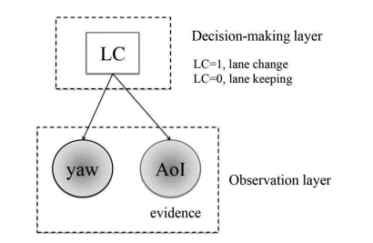
	      </td>
       	<td>
         X. Li, M. Rotting, <strong>W. Wang</strong>
        </td>
		    <td>
				Bayesian Network-based Identification of Driver Lane-changing Intents Using Eye Tracking and Vehicle-Based Data 
              	
 
              		[<a href="javascript:toggleInfo('wang2016bayesian','abstract')">Abstract</a>]
              		[<a href="javascript:toggleInfo('wang2016bayesian','bibtex')">BibTeX</a>] 
              		[<a href="https://www.taylorfrancis.com/chapters/edit/10.1201/9781315265285-147/bayesian-network-based-identification-driver-lane-changing-intents-using-eye-tracking-vehicle-based-data-li-r%C3%B6tting-wang">PDF</a>]
              		<!-- [<a href="https://www.youtube.com/watch?v=CPfXCHWMZW8">Video</a>] -->
              		<!-- [<a href="https://arxiv.org/abs/1805.07843">arXiv</a>] -->
              		<!-- [<a href="https://github.com/zhiyongc/Vehicle-Rear-Light-Data">Data</a> -->
            	

    		</td>
 			  <td>2016</td>
        <td>  13th International Symposium on Advanced Vehicle Control (AVEC)  </td>
      </tr>
      <tr id="abs_wang2016bayesian" class="abstract noshow">
        <td colspan="5">
 <b>Abstract</b>: A Bayesian network decision-making method is proposed by combining driver’s eye-tracking data and vehicle-based data together to identify driver lane-changing intents. First, experiments are conducted in a driving simulator with eye-tracker device to obtain the data when a subject driver makes lane-changing maneuvers. Second, collected data are analyzed in machine learning method using Bayesian decision-making approach to predict driver’s lane-changing intents. Last, to show the benefits of our proposed method, comparison experiments are made between the data fusion way and only using eye tracking data or vehicle-based data. The results show that the Bayesian network with data fusion method performs better than using single information to recognize driver’s lane-changing intents. At the same time, thresholds of Lane-changing probability and vehicle-based data as restricting condition choosing work is discussed in order to select the best identification parameter.
</td>
      </tr>
      <tr id="bib_wang2016bayesian" class="bibtex noshow">
        <td colspan="5"><b>BibTeX</b>:
            <pre>@incollection{li2016bayesian,
                title={Bayesian network-based identification of driver lane-changing intents using eye tracking and vehicle-based data},
                author={Li, XH and R{\"o}tting, M and Wang, WS},
                booktitle={Advanced Vehicle Control AVEC’16},
                pages={299--304},
                year={2016},
                publisher={CRC Press}
              }
            </pre>
			  </td>
      </tr>
      <tr id="wang2016rapid" class="entry">
      	<td>
				  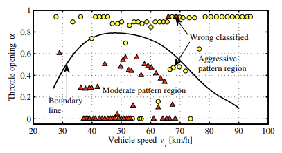
	      </td>
       	<td>
         <strong>W. Wang</strong>, J. Xi
        </td>
		    <td>
				A rapid pattern-recognition method for driving styles using clustering-based support vector machines 
              	
 
              		[<a href="javascript:toggleInfo('wang2016rapid','abstract')">Abstract</a>]
              		[<a href="javascript:toggleInfo('wang2016rapid','bibtex')">BibTeX</a>] 
              		[<a href="https://ieeexplore.ieee.org/abstract/document/7526495">PDF</a>]
              		<!-- [<a href="https://www.youtube.com/watch?v=CPfXCHWMZW8">Video</a>] -->
              		<!-- [<a href="https://arxiv.org/abs/1805.07843">arXiv</a>] -->
              		<!-- [<a href="https://github.com/zhiyongc/Vehicle-Rear-Light-Data">Data</a> -->
            	

    		</td>
 			  <td>2016</td>
        <td>  IEEE American Control Conference (ACC)  </td>
      </tr>
      <tr id="abs_wang2016rapid" class="abstract noshow">
        <td colspan="5">
 <b>Abstract</b>: A rapid pattern-recognition approach to characterize driver's curve-negotiating behavior is proposed. To shorten the recognition time and improve the recognition of driving styles, a k-means clustering-based support vector machine (kMC-SVM) method is developed and used for classifying drivers into two types: aggressive and moderate. First, vehicle speed and throttle opening are treated as the feature parameters to reflect the driving styles. Second, to discriminate driver curve-negotiating behaviors and reduce the number of support vectors, the k-means clustering method is used to extract and gather the two types of driving data and shorten the recognition time. Then, based on the clustering results, a support vector machine approach is utilized to generate the hyperplane for judging and predicting to which types the human driver are subject. Lastly, to verify the validity of the kMC-SVM method, a cross-validation experiment is designed and conducted. The research results show that the kMC-SVM is an effective method to classify driving styles with a short time, compared with SVM method.
</td>
      </tr>
      <tr id="bib_wang2016rapid" class="bibtex noshow">
        <td colspan="5"><b>BibTeX</b>:
            <pre>@inproceedings{wang2016rapid,
                  title={A rapid pattern-recognition method for driving styles using clustering-based support vector machines},
                  author={Wang, Wenshuo and Xi, Junqiang},
                  booktitle={2016 American Control Conference (ACC)},
                  pages={5270--5275},
                  year={2016},
                  organization={IEEE}
                }
            </pre>
			  </td>
      </tr>
      <tr id="wang2015suspension" class="entry">
      	<td>
				  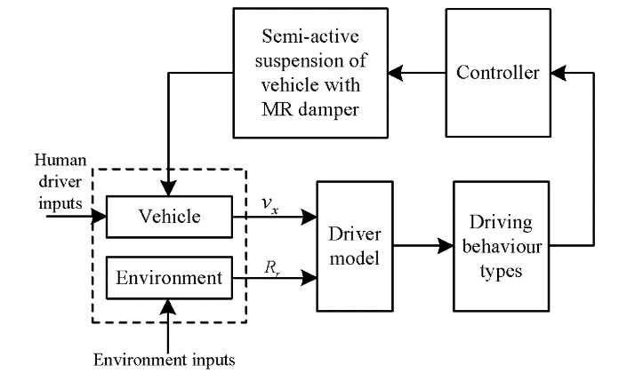
	      </td>
       	<td>
         <strong>W. Wang</strong>, J. Xi
        </td>
		    <td>
				Study of semi-active suspension control strategy based on driving behaviour characteristics 
              	
 
              		[<a href="javascript:toggleInfo('wang2015suspension','abstract')">Abstract</a>]
              		[<a href="javascript:toggleInfo('wang2015suspension','bibtex')">BibTeX</a>] 
              		[<a href="https://ieeexplore.ieee.org/abstract/document/7526495">PDF</a>]
              		<!-- [<a href="https://www.youtube.com/watch?v=CPfXCHWMZW8">Video</a>] -->
              		<!-- [<a href="https://arxiv.org/abs/1805.07843">arXiv</a>] -->
              		<!-- [<a href="https://github.com/zhiyongc/Vehicle-Rear-Light-Data">Data</a> -->
            	

    		</td>
 			  <td>2015</td>
        <td>  International Journal of Vehicle Design  </td>
      </tr>
      <tr id="abs_wang2015suspension" class="abstract noshow">
        <td colspan="5">
 <b>Abstract</b>: In this paper, a semi-active suspension control system incorporatingdriving behaviour characteristics is presented by recognising driver behaviourson the basis of a quarter car model with a magneto-rheological (MR) damper.First, a specific driver model for recognising driver behaviours is developedto accurately recognise drivers’ intentions based on driving data from vehiclesensors. Then, by changing the controllable MR damping ratio in real-timebased on the outputs of the driver model, the individual driver’s expectationof overall comfort or road-holding performance can be satisfied. Furthermore,simulations of the semi-active suspension control strategy with the driver modelcompared with the simulations without the driver model are conducted using Matlab/Simulink. The simulation results indicate that the proposed semi-activesuspension control strategy with embedded driving behaviour characteristics isbetter suited to the driver’s intentions than other control strategies.
</td>
      </tr>
      <tr id="bib_wang2015suspension" class="bibtex noshow">
        <td colspan="5"><b>BibTeX</b>:
            <pre>@article{wang2015study,
                  title={Study of semi-active suspension control strategy based on driving behaviour characteristics},
                  author={Wang, Wenshuo and Xi, Junqiang},
                  journal={International Journal of Vehicle Design},
                  volume={68},
                  number={1-3},
                  pages={141--161},
                  year={2015},
                  publisher={Inderscience Publishers (IEL)}
                }
            </pre>
			  </td>
      </tr>
	</tbody>
</table>

<!-- ## Teaching

<table style="width:100%">
  <thead>
    <tr>
      <th width="100%">&nbsp;</th>
    </tr>
	</tbody>
</table>

## Teaching

<table style="width:100%">
  <thead>
    <tr>
      <th width="100%">&nbsp;</th>
    </tr>
  </thead>
</table> -->

## Patents
4. **Wenshuo Wang**, Aditya Ramesh, Ding Zhao. [Unsurpervised classification of encountering scenarios using connected vehicle datasets](https://patents.google.com/patent/US20200133269A1/en). US20200133269A1, USA, 2020

3. Ding Zhao, Jiacheng Zhu, **Wenshuo Wang**. [System and method for unifying heterogenous datasets using primitives](https://patents.google.com/patent/US20200193324A1/en). US20200193324A1, USA, 2020

2. Ding Zhao, Senyu Mou, Yan Chang, **Wenshuo Wang**. [System and method for determining optimal LiDAR placement on autonomous vehicles](https://patents.google.com/patent/US20200191972A1/en). US20200191972A1, USA, 2020

1. Junqiang Xi and **Wenshuo Wang**. [Intelligent driving systems with an embedded driver model](https://patents.google.com/patent/US10286900B2/en). US20170297564A1, USA, 2019
